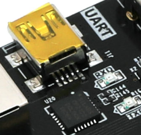
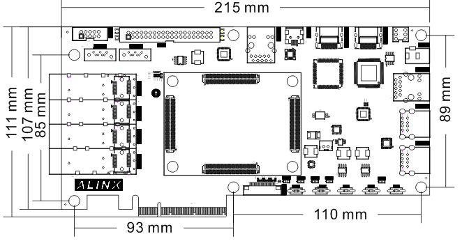

开发板硬件介绍
================

 芯驿电子科技（上海）有限公司 基于XILINX
ZYNQ7000开发平台的开发板（型号：AX7Z035）2019款正式发布了正式发布了，为了让您对此开发平台可以快速了解，我们编写了此用户手册。

这款ZYNQ7000
FPGA开发平台采用核心板加扩展板的模式，方便用户对核心板的二次开发利用。核心板使用XILINX的Zynq7000
SOC芯片XC7Z035的解决方案，它采用ARM+FPGA SOC技术将双核ARM Cortex-A9
和FPGA 可编程逻辑集成在一颗芯片上。另外核心板上含有4片共2GB高速DDR3
SDRAM芯片，1片8GB的eMMC存储芯片和1片256Mb的QSPI FLASH芯片。

在底板设计上我们为用户扩展了丰富的外围接口，比如1个PCIex4
接口、4路光纤接口、2路千兆以太网接口、4路USB2.0
HOST接口、1路HDMI输出接口、1路HDMI输入接口、1路UART串口接口、1路SD卡接口、1个40针扩展接口等等。满足用户各种高速数据交换，数据存储，视频传输处理以及工业控制的要求，是一款"专业级“的ZYNQ开发平台。为高速数据传输和交换，数据处理的前期验证和后期应用提供了可能。相信这样的一款产品非常适合从事ZYNQ开发的学生、工程师等群体。

      
开发板简介
----------

在这里，对这款AX7Z035 ZYNQ开发平台进行简单的功能介绍。

开发板的整个结构，继承了我们一贯的核心板+扩展板的模式来设计的。核心板和扩展板之间使用高速板间连接器连接。

核心板主要由ZYNQ7035 + 4个DDR3 + eMMC + QSPI
FLASH的最小系统构成。ZYNQ7035采用Xilinx公司的Zynq7000系列的芯片，型号为XC7Z035-2FFG676。ZYNQ7035芯片可分成处理器系统部分Processor
System（PS）和可编程逻辑部分Programmable
Logic（PL）。在ZYNQ7035芯片的PS端和PL端分别挂了2片DDR3，每片DDR3容量高达512M字节，使得ARM系统和FPGA系统能独立处理和存储的数据的功能。PS端的8GB
eMMC FLASH存储芯片和512Mb的QSPI
FLASH用来静态存储ZYNQ的操作系统、文件系统及用户数据。

底板为核心板扩展了丰富的外围接口，其中包含1个PCIex4接口、4路光纤接口、2路千兆以太网接口（PS和PL各一路）、4路USB2.0
HOST接口、1路HDMI输出接口、1路HDMI输出接口、1路UART串口接口、1路SD卡接口、1个40针扩展接口和一些按键LED。

下图为整个开发系统的结构示意图：

通过这个示意图，我们可以看到，我们这个开发平台所能含有的接口和功能。

-   ZYNQ7035核心板

由XC7Z035+2GB DDR3+8GB eMMC FLASH + 512Mb QSPI
FLASH组成，另外有三个晶振提供时钟，一个单端33.3333MHz晶振提供给PS系统，一个差分200MHz晶振提供给PL逻辑DDR参考时钟，另外一个差分125MHz晶振提供给GTX收发器参考时钟。

-  PCIe x4接口

支持PCI Express 2.0标准，提供标准的PCIe
x4高速数据传输接口，单通道通信速率可高达5GBaud。

-  4路SFP光纤接口

ZYNQ的GTX收发器的4路高速收发器连接到4个光模块的发送和接收，实现4路高速的光纤通信接口。每路的光纤数据通信接收和发送的速度高达10Gb/s。

-  千兆以太网接口

2路10/100M/1000M以太网RJ45接口，用于和电脑或其它网络设备进行以太网数据交换。网络接口芯片采用Micrel公司的KSZ9031工业级GPHY芯片，1路以太网连接到ZYNQ芯片的PS端，1路以太网连接到ZYNQ芯片的PL端。

-  HDMI视频输出

1路HDMI视频输出接口，我们选用了ANALOG DEVICE公司的ADV7511
HDMI编码芯片，最高支持1080P@60Hz输出，支持3D输出。

-  HDMI视频输入

1路HDMI视频输入接口，我们选用了Silion Image公司的SIL9011/SIL9013
HDMI解码芯片，最高支持1080P@60Hz输入，支持不同格式的数据输入。

-  USB2.0 HOST接口

通过USB Hub芯片扩展4路USB
HOST接口，用于连接外部的USB从设备，比如连接鼠标，键盘，U盘等等。USB接口采用扁型USB接口(USB
Type A)。

-  USB Uart接口

1路Uart转USB接口，用于和电脑通信，方便用户调试。串口芯片采用Silicon Labs
CP2102GM的USB-UAR芯片, USB接口采用MINI USB接口。

-  Micro SD卡座

1路Micro SD卡座，用于存储操作系统镜像和文件系统。

-  40针扩展口

1个40针2.54mm间距的扩展口，可以外接黑金的各种模块（双目摄像头，TFT
LCD屏，高速AD模块等等）。扩展口包含5V电源1路，3.3V电源2路，地3路，IO口34路。

-  JTAG调试口

1个10针2.54mm标准的JTAG口，用于FPGA程序的下载和调试，用户可以通过XILINX下载器对ZYNQ系统进行调试和下载。

-  LED灯

10个发光二极管LED,
核心板上3个，底板上7个。核心板上1个电源指示灯；1个DONE配置指示灯；1个用户指示灯。底板上有1个电源指示灯，4个用户指示灯和2个串口指示灯。

-  按键

5个按键，1个复位按键， 4个PL用户按键。

AC7Z035核心板
-------------

简介
~~~~

AC7Z035(**核心板型号，下同**)核心板，ZYNQ芯片是基于XILINX公司的ZYNQ7000系列的XC7Z035-2FFG676。ZYNQ芯片的PS系统集成了两个ARM
Cortex™-A9处理器，AMBA®互连，内部存储器，外部存储器接口和外设。ZYNQ芯片的FPGA内部含有丰富的可编程逻辑单元，DSP和内部RAM。

这款核心板使用了4片Micron的512MB的DDR3芯片MT41J256M16HA-125,总的容量达2GB。其中PS和PL端各挂载两片，分别组成32bit的总线宽度。PS端的DDR3
SDRAM的最高运行速度可达533MHz(数据速率1066Mbps)，PL端的DDR3
SDRAM的最高运行速度可达800MHz(数据速率1600Mbps)。另外核心板上也集成了2片256MBit大小的QSPI
FLASH和8GB大小的eMMC FLASH芯片，用于启动存储配置和系统文件。

为了和底板连接，这款核心板的4个板对板连接器扩展出了PS端的USB接口，千兆以太网接口，SD卡接口及其它剩余的MIO口；也扩展出了ZYNQ的8对高速收发器GTX接口；以及PL端的几乎所有IO口（144个），其中BANK12和BANK13的IO的电平可以通过更换核心板上的LDO芯片来修改，满足用户不用电平接口的要求。对于需要大量IO的用户，此核心板将是不错的选择。而且IO连接部分，ZYNQ芯片到接口之间走线做了等长和差分处理，并且核心板尺寸仅为80*60（mm），对于二次开发来说，非常适合。

      
AC7Z035核心板正面图

      
AC7Z035核心板背面图

ZYNQ芯片
~~~~~~~~

开发板使用的是Xilinx公司的Zynq7000系列的芯片，型号为XC7Z035-2FFG676。芯片的PS系统集成了两个ARM
Cortex™-A9处理器，AMBA®互连，内部存储器，外部存储器接口和外设。这些外设主要包括USB总线接口，以太网接口，SD/SDIO接口，I2C总线接口，CAN总线接口，UART接口，GPIO等。PS可以独立运行并在上电或复位下启动。ZYNQ7000芯片的总体框图如图2-2-1所示

.. image:: images/03_media/image5.png
      
图2-2-1 ZYNQ7000芯片的总体框图

其中PS系统部分的主要参数如下：

-  基于ARM 双核CortexA9 的应用处理器，ARM-v7架构 高达800MHz

-  每个CPU 32KB 1级指令和数据缓存，512KB 2级缓存 2个CPU共享

-  片上boot ROM和256KB 片内RAM

-  外部存储接口，支持16/32 bit DDR2、DDR3接口

-  两个千兆网卡支持：发散-聚集DMA ，GMII，RGMII，SGMII接口

-  两个USB2.0 OTG接口，每个最多支持12节点

-  两个CAN2.0B总线接口

-  两个SD卡、SDIO、MMC兼容控制器

-  2个SPI，2个UARTs，2个I2C接口

-  54个多功能配置的IO，可以软件配置成普通IO或者外设控制接口

-  PS内和PS到PL的高带宽连接

其中PL逻辑部分的主要参数如下：

-  逻辑单元Logic Cells：275K；

-  查找表LUTs: 171,900

-  触发器(flip-flops):343,800

-  乘法器18x25MACCs：900;

-  Block RAM：17.6Mb；

-  8路高速GTX收发器，支持PCIE Gen2x8；

-  2个AD转换器,可以测量片上电压、温度感应和高达17外部差分输入通道，1MBPS

XC7Z035-2FFG676I芯片的速度等级为-2，工业级，封装为FGG676，引脚间距为1.0mm，ZYNQ7000系列的具体的芯片型号定义如下图2-2所示。

.. image:: images/03_media/image6.png
      
图2-2-2 ZYNQ型号命名规则定义

图2-2-3为开发板所用的XC7Z035芯片实物图。

      
图2-3 XC7Z035芯片实物

DDR3 DRAM
~~~~~~~~~

AX7Z035开发板上配有四片Micron(美光）的512MB的DDR3芯片,型号为MT41J256M16HA-125(兼容MT41K256M16HA-125)，其中PS和PL端各挂载两片。两片DDR3
SDRAM组成32bit的总线宽度。PS端的DDR3
SDRAM的最高运行速度可达533MHz(数据速率1066Mbps)，两片DDR3存储系统直接连接到了ZYNQ处理系统（PS）的BANK
502的存储器接口上。PL端的DDR3
SDRAM的最高运行速度可达800MHz(数据速率1600Mbps)，两片DDR3存储系统连接到了FPGA的BANK33,
BANK34的接口上。DDR3 SDRAM的具体配置如下表2-3-1所示。

表2-3-1 DDR3 SDRAM配置

+--------------+--------------------+------------------+--------------+
| **位号**     | **芯片型号**       | **容量**         | **厂家**     |
+==============+====================+==================+==============+
| U4,U5,U7,U8  | MT41J256M16HA-125  | 256M x 16bit     | Micron       |
+--------------+--------------------+------------------+--------------+

DDR3的硬件设计需要严格考虑信号完整性，我们在电路设计和PCB设计的时候已经充分考虑了匹配电阻/终端电阻,走线阻抗控制，走线等长控制，　保证DDR3的高速稳定的工作。

PS端的DDR3 DRAM的硬件连接方式如图2-3-1所示:

图2-3-1 PS端DDR3 DRAM原理图部分

PL端的DDR3 DRAM的硬件连接方式如图2-3-2所示:

.. image:: images/03_media/image9.png

图2-3-2 PL端DDR3 DRAM原理图部分

**PS端DDR3 DRAM引脚分配：**

+-----------------------+----------------------+-----------------------+
| **信号名称**          | **ZYNQ引脚名**       | **ZYNQ引脚号**        |
+=======================+======================+=======================+
| **PS_DDR3_DQS0_P**    | PS_DDR_DQS_P0_502    | H24                   |
+-----------------------+----------------------+-----------------------+
| **PS_DDR3_DQS0_N**    | PS_DDR_DQS_N0_502    | G25                   |
+-----------------------+----------------------+-----------------------+
| **PS_DDR3_DQS1_P**    | PS_DDR_DQS_P1_502    | L24                   |
+-----------------------+----------------------+-----------------------+
| **PS_DDR3_DQS1_N**    | PS_DDR_DQS_N1_502    | L25                   |
+-----------------------+----------------------+-----------------------+
| **PS_DDR3_DQS2_P**    | PS_DDR_DQS_P2_502    | P25                   |
+-----------------------+----------------------+-----------------------+
| **PS_DDR3_DQS2_N**    | PS_DDR_DQS_N2_502    | R25                   |
+-----------------------+----------------------+-----------------------+
| **PS_DDR3_DQS3_P**    | PS_DDR_DQS_P3_502    | W24                   |
+-----------------------+----------------------+-----------------------+
| **PS_DDR3_DQS4_N**    | PS_DDR_DQS_N3_502    | W25                   |
+-----------------------+----------------------+-----------------------+
| **PS_DDR3_D0**        | PS_DDR_DQ0_502       | J26                   |
+-----------------------+----------------------+-----------------------+
| **PS_DDR3_D1**        | PS_DDR_DQ1_502       | F25                   |
+-----------------------+----------------------+-----------------------+
| **PS_DDR3_D2**        | PS_DDR_DQ2_502       | J25                   |
+-----------------------+----------------------+-----------------------+
| **PS_DDR3_D3**        | PS_DDR_DQ3_502       | G26                   |
+-----------------------+----------------------+-----------------------+
| **PS_DDR3_D4**        | PS_DDR_DQ4_502       | H26                   |
+-----------------------+----------------------+-----------------------+
| **PS_DDR3_D5**        | PS_DDR_DQ5_502       | H23                   |
+-----------------------+----------------------+-----------------------+
| **PS_DDR3_D6**        | PS_DDR_DQ6_502       | J24                   |
+-----------------------+----------------------+-----------------------+
| **PS_DDR3_D7**        | PS_DDR_DQ7_502       | J23                   |
+-----------------------+----------------------+-----------------------+
| **PS_DDR3_D8**        | PS_DDR_DQ8_502       | K26                   |
+-----------------------+----------------------+-----------------------+
| **PS_DDR3_D9**        | PS_DDR_DQ9_502       | L23                   |
+-----------------------+----------------------+-----------------------+
| **PS_DDR3_D10**       | PS_DDR_DQ10_502      | M26                   |
+-----------------------+----------------------+-----------------------+
| **PS_DDR3_D11**       | PS_DDR_DQ11_502      | K23                   |
+-----------------------+----------------------+-----------------------+
| **PS_DDR3_D12**       | PS_DDR_DQ12_502      | M25                   |
+-----------------------+----------------------+-----------------------+
| **PS_DDR3_D13**       | PS_DDR_DQ13_502      | N24                   |
+-----------------------+----------------------+-----------------------+
| **PS_DDR3_D14**       | PS_DDR_DQ14_502      | M24                   |
+-----------------------+----------------------+-----------------------+
| **PS_DDR3_D15**       | PS_DDR_DQ15_502      | N23                   |
+-----------------------+----------------------+-----------------------+
| **PS_DDR3_D16**       | PS_DDR_DQ16_502      | R26                   |
+-----------------------+----------------------+-----------------------+
| **PS_DDR3_D17**       | PS_DDR_DQ17_502      | P24                   |
+-----------------------+----------------------+-----------------------+
| **PS_DDR3_D18**       | PS_DDR_DQ18_502      | N26                   |
+-----------------------+----------------------+-----------------------+
| **PS_DDR3_D19**       | PS_DDR_DQ19_502      | P23                   |
+-----------------------+----------------------+-----------------------+
| **PS_DDR3_D20**       | PS_DDR_DQ20_502      | T24                   |
+-----------------------+----------------------+-----------------------+
| **PS_DDR3_D21**       | PS_DDR_DQ21_502      | T25                   |
+-----------------------+----------------------+-----------------------+
| **PS_DDR3_D22**       | PS_DDR_DQ22_502      | T23                   |
+-----------------------+----------------------+-----------------------+
| **PS_DDR3_D23**       | PS_DDR_DQ23_502      | R23                   |
+-----------------------+----------------------+-----------------------+
| **PS_DDR3_D24**       | PS_DDR_DQ24_502      | V24                   |
+-----------------------+----------------------+-----------------------+
| **PS_DDR3_D25**       | PS_DDR_DQ25_502      | U26                   |
+-----------------------+----------------------+-----------------------+
| **PS_DDR3_D26**       | PS_DDR_DQ26_502      | U24                   |
+-----------------------+----------------------+-----------------------+
| **PS_DDR3_D27**       | PS_DDR_DQ27_502      | U25                   |
+-----------------------+----------------------+-----------------------+
| **PS_DDR3_D28**       | PS_DDR_DQ28_502      | W26                   |
+-----------------------+----------------------+-----------------------+
| **PS_DDR3_D29**       | PS_DDR_DQ29_502      | Y25                   |
+-----------------------+----------------------+-----------------------+
| **PS_DDR3_D30**       | PS_DDR_DQ30_502      | Y26                   |
+-----------------------+----------------------+-----------------------+
| **PS_DDR3_D31**       | PS_DDR_DQ31_502      | W23                   |
+-----------------------+----------------------+-----------------------+
| **PS_DDR3_DM0**       | PS_DDR_DM0_502       | G24                   |
+-----------------------+----------------------+-----------------------+
| **PS_DDR3_DM1**       | PS_DDR_DM1_502       | K25                   |
+-----------------------+----------------------+-----------------------+
| **PS_DDR3_DM2**       | PS_DDR_DM2_502       | P26                   |
+-----------------------+----------------------+-----------------------+
| **PS_DDR3_DM3**       | PS_DDR_DM3_502       | V26                   |
+-----------------------+----------------------+-----------------------+
| **PS_DDR3_A0**        | PS_DDR_A0_502        | K22                   |
+-----------------------+----------------------+-----------------------+
| **PS_DDR3_A1**        | PS_DDR_A1_502        | K20                   |
+-----------------------+----------------------+-----------------------+
| **PS_DDR3_A2**        | PS_DDR_A2_502        | N21                   |
+-----------------------+----------------------+-----------------------+
| **PS_DDR3_A3**        | PS_DDR_A3_502        | L22                   |
+-----------------------+----------------------+-----------------------+
| **PS_DDR3_A4**        | PS_DDR_A4_502        | M20                   |
+-----------------------+----------------------+-----------------------+
| **PS_DDR3_A5**        | PS_DDR_A5_502        | N22                   |
+-----------------------+----------------------+-----------------------+
| **PS_DDR3_A6**        | PS_DDR_A6_502        | L20                   |
+-----------------------+----------------------+-----------------------+
| **PS_DDR3_A7**        | PS_DDR_A7_502        | J21                   |
+-----------------------+----------------------+-----------------------+
| **PS_DDR3_A8**        | PS_DDR_A8_502        | T20                   |
+-----------------------+----------------------+-----------------------+
| **PS_DDR3_A9**        | PS_DDR_A9_502        | U20                   |
+-----------------------+----------------------+-----------------------+
| **PS_DDR3_A10**       | PS_DDR_A10_502       | M22                   |
+-----------------------+----------------------+-----------------------+
| **PS_DDR3_A11**       | PS_DDR_A11_502       | H21                   |
+-----------------------+----------------------+-----------------------+
| **PS_DDR3_A12**       | PS_DDR_A12_502       | P20                   |
+-----------------------+----------------------+-----------------------+
| **PS_DDR3_A13**       | PS_DDR_A13_502       | J20                   |
+-----------------------+----------------------+-----------------------+
| **PS_DDR3_A14**       | PS_DDR_A14_502       | R20                   |
+-----------------------+----------------------+-----------------------+
| **PS_DDR3_BA0**       | PS_DDR_BA0_502       | U22                   |
+-----------------------+----------------------+-----------------------+
| **PS_DDR3_BA1**       | PS_DDR_BA1_502       | T22                   |
+-----------------------+----------------------+-----------------------+
| **PS_DDR3_BA2**       | PS_DDR_BA2_502       | R22                   |
+-----------------------+----------------------+-----------------------+
| **PS_DDR3_S0**        | PS_DDR_CS_B_502      | Y21                   |
+-----------------------+----------------------+-----------------------+
| **PS_DDR3_RAS**       | PS_DDR_RAS_B_502     | V23                   |
+-----------------------+----------------------+-----------------------+
| **PS_DDR3_CAS**       | PS_DDR_CAS_B_502     | Y23                   |
+-----------------------+----------------------+-----------------------+
| **PS_DDR3_WE**        | PS_DDR_WE_B_502      | V22                   |
+-----------------------+----------------------+-----------------------+
| **PS_DDR3_ODT**       | PS_DDR_ODT_502       | Y22                   |
+-----------------------+----------------------+-----------------------+
| **PS_DDR3_RESET**     | PS_DDR_DRST_B_502    | H22                   |
+-----------------------+----------------------+-----------------------+
| **PS_DDR3_CLK0_P**    | PS_DDR_CKP_502       | R21                   |
+-----------------------+----------------------+-----------------------+
| **PS_DDR3_CLK0_N**    | PS_DDR_CKN_502       | P21                   |
+-----------------------+----------------------+-----------------------+
| **PS_DDR3_CKE**       | PS_DDR_CKE_502       | U21                   |
+-----------------------+----------------------+-----------------------+

**PL端DDR3 DRAM引脚分配：**

+-----------------------+-----------------------+---------------------+
| **信号名称**          | **ZYNQ引脚名**        | **ZYNQ引脚号**      |
+=======================+=======================+=====================+
| **PL_DDR3_DQS0_P**    | IO_L3P_T0_DQS_33      | G2                  |
+-----------------------+-----------------------+---------------------+
| **PL_DDR3_DQS0_N**    | IO_L3N_T0_DQS_33      | F2                  |
+-----------------------+-----------------------+---------------------+
| **PL_DDR3_DQS1_P**    | IO_L9P_T1_DQS_33      | K2                  |
+-----------------------+-----------------------+---------------------+
| **PL_DDR3_DQS1_N**    | IO_L9N_T1_DQS_33      | K1                  |
+-----------------------+-----------------------+---------------------+
| **PL_DDR3_DQS2_P**    | IO_L15P_T2_DQS_33     | N3                  |
+-----------------------+-----------------------+---------------------+
| **PL_DDR3_DQS2_N**    | IO_L15N_T2_DQS_33     | N2                  |
+-----------------------+-----------------------+---------------------+
| **PL_DDR3_DQS3_P**    | IO_L21P_T3_DQS_33     | M8                  |
+-----------------------+-----------------------+---------------------+
| **PL_DDR3_DQS4_N**    | IO_L21N_T3_DQS_33     | L8                  |
+-----------------------+-----------------------+---------------------+
| **PL_DDR3_D0**        | IO_L5N_T0_33          | E1                  |
+-----------------------+-----------------------+---------------------+
| **PL_DDR3_D1**        | IO_L1N_T0_33          | F4                  |
+-----------------------+-----------------------+---------------------+
| **PL_DDR3_D2**        | IO_L4P_T0_33          | D1                  |
+-----------------------+-----------------------+---------------------+
| **PL_DDR3_D3**        | IO_L1P_T0_33          | G4                  |
+-----------------------+-----------------------+---------------------+
| **PL_DDR3_D4**        | IO_L2N_T0_33          | D3                  |
+-----------------------+-----------------------+---------------------+
| **PL_DDR3_D5**        | IO_L5P_T0_33          | E2                  |
+-----------------------+-----------------------+---------------------+
| **PL_DDR3_D6**        | IO_L2P_T0_33          | D4                  |
+-----------------------+-----------------------+---------------------+
| **PL_DDR3_D7**        | IO_L4N_T0_33          | C1                  |
+-----------------------+-----------------------+---------------------+
| **PL_DDR3_D8**        | IO_L7N_T1_33          | H1                  |
+-----------------------+-----------------------+---------------------+
| **PL_DDR3_D9**        | IO_L10N_T1_33         | G1                  |
+-----------------------+-----------------------+---------------------+
| **PL_DDR3_D10**       | IO_L7P_T1_33          | J1                  |
+-----------------------+-----------------------+---------------------+
| **PL_DDR3_D11**       | IO_L8N_T1_33          | H3                  |
+-----------------------+-----------------------+---------------------+
| **PL_DDR3_D12**       | IO_L11N_T1_SRCC_33    | K3                  |
+-----------------------+-----------------------+---------------------+
| **PL_DDR3_D13**       | IO_L8P_T1_33          | H4                  |
+-----------------------+-----------------------+---------------------+
| **PL_DDR3_D14**       | IO_L11P_T1_SRCC_33    | L3                  |
+-----------------------+-----------------------+---------------------+
| **PL_DDR3_D15**       | IO_L10P_T1_33         | H2                  |
+-----------------------+-----------------------+---------------------+
| **PL_DDR3_D16**       | IO_L18P_T2_33         | N1                  |
+-----------------------+-----------------------+---------------------+
| **PL_DDR3_D17**       | IO_L14P_T2_SRCC_33    | L5                  |
+-----------------------+-----------------------+---------------------+
| **PL_DDR3_D18**       | IO_L14N_T2_SRCC_33    | L4                  |
+-----------------------+-----------------------+---------------------+
| **PL_DDR3_D19**       | IO_L13P_T2_MRCC_33    | M6                  |
+-----------------------+-----------------------+---------------------+
| **PL_DDR3_D20**       | IO_L16P_T2_33         | M2                  |
+-----------------------+-----------------------+---------------------+
| **PL_DDR3_D21**       | IO_L17P_T2_33         | N4                  |
+-----------------------+-----------------------+---------------------+
| **PL_DDR3_D22**       | IO_L16N_T2_33         | L2                  |
+-----------------------+-----------------------+---------------------+
| **PL_DDR3_D23**       | IO_L17N_T2_33         | M4                  |
+-----------------------+-----------------------+---------------------+
| **PL_DDR3_D24**       | IO_L23P_T3_33         | N7                  |
+-----------------------+-----------------------+---------------------+
| **PL_DDR3_D25**       | IO_L22N_T3_33         | J6                  |
+-----------------------+-----------------------+---------------------+
| **PL_DDR3_D26**       | IO_L19P_T3_33         | M7                  |
+-----------------------+-----------------------+---------------------+
| **PL_DDR3_D27**       | IO_L20N_T3_33         | J5                  |
+-----------------------+-----------------------+---------------------+
| **PL_DDR3_D28**       | IO_L24P_T3_33         | K8                  |
+-----------------------+-----------------------+---------------------+
| **PL_DDR3_D29**       | IO_L20P_T3_33         | K5                  |
+-----------------------+-----------------------+---------------------+
| **PL_DDR3_D30**       | IO_L24N_T3_33         | K7                  |
+-----------------------+-----------------------+---------------------+
| **PL_DDR3_D31**       | IO_L22P_T3_33         | K6                  |
+-----------------------+-----------------------+---------------------+
| **PL_DDR3_DM0**       | IO_L6P_T0_33          | F3                  |
+-----------------------+-----------------------+---------------------+
| **PL_DDR3_DM1**       | IO_L12P_T1_MRCC_33    | J4                  |
+-----------------------+-----------------------+---------------------+
| **PL_DDR3_DM2**       | IO_L13N_T2_MRCC_33    | M5                  |
+-----------------------+-----------------------+---------------------+
| **PL_DDR3_DM3**       | IO_L23N_T3_33         | N6                  |
+-----------------------+-----------------------+---------------------+
| **PL_DDR3_A0**        | IO_L17N_T2_34         | A8                  |
+-----------------------+-----------------------+---------------------+
| **PL_DDR3_A1**        | IO_L23P_T3_34         | C2                  |
+-----------------------+-----------------------+---------------------+
| **PL_DDR3_A2**        | IO_L14P_T2_SRCC_34    | D6                  |
+-----------------------+-----------------------+---------------------+
| **PL_DDR3_A3**        | IO_L15N_T2_DQS_34     | B9                  |
+-----------------------+-----------------------+---------------------+
| **PL_DDR3_A4**        | IO_L10N_T1_34         | D5                  |
+-----------------------+-----------------------+---------------------+
| **PL_DDR3_A5**        | IO_L17P_T2_34         | A9                  |
+-----------------------+-----------------------+---------------------+
| **PL_DDR3_A6**        | IO_L11N_T1_SRCC_34    | E7                  |
+-----------------------+-----------------------+---------------------+
| **PL_DDR3_A7**        | IO_L15P_T2_DQS_34     | C9                  |
+-----------------------+-----------------------+---------------------+
| **PL_DDR3_A8**        | IO_L12N_T1_MRCC_34    | F7                  |
+-----------------------+-----------------------+---------------------+
| **PL_DDR3_A9**        | IO_L18N_T2_34         | A7                  |
+-----------------------+-----------------------+---------------------+
| **PL_DDR3_A10**       | IO_L24N_T3_34         | A2                  |
+-----------------------+-----------------------+---------------------+
| **PL_DDR3_A11**       | IO_L11P_T1_SRCC_34    | F8                  |
+-----------------------+-----------------------+---------------------+
| **PL_DDR3_A12**       | IO_L23N_T3_34         | B1                  |
+-----------------------+-----------------------+---------------------+
| **PL_DDR3_A13**       | IO_L16P_T2_34         | B10                 |
+-----------------------+-----------------------+---------------------+
| **PL_DDR3_A14**       | IO_L12P_T1_MRCC_34    | G7                  |
+-----------------------+-----------------------+---------------------+
| **PL_DDR3_BA0**       | IO_L18P_T2_34         | B7                  |
+-----------------------+-----------------------+---------------------+
| **PL_DDR3_BA1**       | IO_L19N_T3_VREF_34    | C3                  |
+-----------------------+-----------------------+---------------------+
| **PL_DDR3_BA2**       | IO_L22N_T3_34         | A3                  |
+-----------------------+-----------------------+---------------------+
| **PL_DDR3_S0**        | IO_L14N_T2_SRCC_34    | C6                  |
+-----------------------+-----------------------+---------------------+
| **PL_DDR3_RAS**       | IO_L19P_T3_34         | C4                  |
+-----------------------+-----------------------+---------------------+
| **PL_DDR3_CAS**       | IO_L20N_T3_34         | B4                  |
+-----------------------+-----------------------+---------------------+
| **PL_DDR3_WE**        | IO_L20P_T3_34         | B5                  |
+-----------------------+-----------------------+---------------------+
| **PL_DDR3_ODT**       | IO_L22P_T3_34         | A4                  |
+-----------------------+-----------------------+---------------------+
| **PL_DDR3_RESET**     | IO_L16N_T2_34         | A10                 |
+-----------------------+-----------------------+---------------------+
| **PL_DDR3_CLK0_P**    | IO_L21P_T3_DQS_34     | B6                  |
+-----------------------+-----------------------+---------------------+
| **PL_DDR3_CLK0_N**    | IO_L21N_T3_DQS_34     | A5                  |
+-----------------------+-----------------------+---------------------+
| **PL_DDR3_CKE**       | IO_L24P_T3_34         | B2                  |
+-----------------------+-----------------------+---------------------+

QSPI Flash
~~~~~~~~~~

开发板配有2片256MBit大小的Quad-SPI
FLASH芯片组成8位带宽数据总线，FLASH型号为W25Q256FVEI，它使用3.3V
CMOS电压标准。由于QSPI FLASH的非易失特性，在使用中，
它可以作为系统的启动设备来存储系统的启动镜像。这些镜像主要包括FPGA的bit文件、ARM的应用程序代码以及其它的用户数据文件。QSPI
FLASH的具体型号和相关参数见表2-4-1。

+--------------+--------------------+------------------+--------------+
| **位号**     | **芯片类型**       | **容量**         | **厂家**     |
+==============+====================+==================+==============+
| U13,U14      | W25Q256FVEI        | 256M bit         | Winbond      |
+--------------+--------------------+------------------+--------------+

表2-4-1 QSPI Flash的型号和参数

QSPI
FLASH连接到ZYNQ芯片的PS部分BANK500的GPIO口上，在系统设计中需要配置这些PS端的GPIO口功能为QSPI
FLASH接口。为图4-1为QSPI Flash在原理图中的部分。

图2-4-1 QSPI Flash连接示意图

**配置芯片引脚分配：**

+-----------------------------+------------------+---------------------+
| **信号名称**                | **ZYNQ引脚名**   | **ZYNQ引脚号**      |
+=============================+==================+=====================+
| **QSPI0_SCK**               | PS_MIO6_500      | F23                 |
+-----------------------------+------------------+---------------------+
| **QSPI0_CS**                | PS_MIO1_500      | D26                 |
+-----------------------------+------------------+---------------------+
| **QSPI0_D0**                | PS_MIO2_500      | E25                 |
+-----------------------------+------------------+---------------------+
| **QSPI0_D1**                | PS_MIO3_500      | D25                 |
+-----------------------------+------------------+---------------------+
| **QSPI0_D2**                | PS_MIO4_500      | F24                 |
+-----------------------------+------------------+---------------------+
| **QSPI0_D3**                | PS_MIO5_500      | C26                 |
+-----------------------------+------------------+---------------------+
| **QSPI1_SCK**               | PS_MIO9_500      | D24                 |
+-----------------------------+------------------+---------------------+
| **QSPI1_CS**                | PS_MIO0_500      | E26                 |
+-----------------------------+------------------+---------------------+
| **QSPI1_D0**                | PS_MIO10_500     | A25                 |
+-----------------------------+------------------+---------------------+
| **QSPI1_D1**                | PS_MIO11_500     | B26                 |
+-----------------------------+------------------+---------------------+
| **QSPI1_D2**                | PS_MIO12_500     | A23                 |
+-----------------------------+------------------+---------------------+
| **QSPI1_D3**                | PS_MIO13_500     | B25                 |
+-----------------------------+------------------+---------------------+

eMMC Flash
~~~~~~~~~~

开发板配有一片大容量的8GB大小的eMMC
FLASH芯片，型号为THGBMFG6C1LBAIL，它支持JEDEC e-MMC
V5.0标准的HS-MMC接口，电平支持1.8V或者3.3V。eMMC
FLASH和ZYNQ连接的数据宽度为4bit。由于eMMC
FLASH的大容量和非易失特性，在ZYNQ系统使用中，它可以作为系统大容量的存储设备，比如存储ARM的应用程序、系统文件以及其它的用户数据文件。eMMC
FLASH的具体型号和相关参数见表2-5-1。

+--------------+--------------------+------------------+--------------+
| **位号**     | **芯片类型**       | **容量**         | **厂家**     |
+==============+====================+==================+==============+
| U11          | THGBMFG6C1LBAIL    | 8G Byte          | TOSHIBA      |
+--------------+--------------------+------------------+--------------+

表2-5-1 eMMC Flash的型号和参数

eMMC
FLASH连接到ZYNQ芯片的PS部分BANK501的GPIO口上，在系统设计中需要配置这些PS端的GPIO口功能为SD接口。为图2-5-1为eMMC
Flash在原理图中的部分。

图2-5-1 eMMC Flash连接示意图

**配置芯片引脚分配：**

+-----------------------------+------------------+---------------------+
| **信号名称**                | **ZYNQ引脚名**   | **ZYNQ引脚号**      |
+=============================+==================+=====================+
| **MMC_CCLK**                | PS_MIO48_501     | B21                 |
+-----------------------------+------------------+---------------------+
| **MMC_CMD**                 | PS_MIO47_501     | B19                 |
+-----------------------------+------------------+---------------------+
| **MMC_D0**                  | PS_MIO46_501     | E17                 |
+-----------------------------+------------------+---------------------+
| **MMC_D1**                  | PS_MIO49_501     | A18                 |
+-----------------------------+------------------+---------------------+
| **MMC_D2**                  | PS_MIO50_501     | B22                 |
+-----------------------------+------------------+---------------------+
| **MMC_D3**                  | PS_MIO51_501     | B20                 |
+-----------------------------+------------------+---------------------+

时钟配置
~~~~~~~~

核心板上分别为PS系统,
PL逻辑部分和GTX收发器提供了参考时钟，使PS系统和PL逻辑可以单独工作。时钟电路设计的示意图如下图2-6-1所示：

图 2-6-1 核心板时钟源

**PS系统时钟源**

ZYNQ芯片通过开发板上的X4晶振为PS部分提供33.333MHz的时钟输入。时钟的输入连接到ZYNQ芯片的BANK500的PS_CLK_500的管脚上。其原理图如图2-6-2所示：

      
图2-6-2 PS部分的有源晶振

**时钟引脚分配：**

+-----------------------------------+-----------------------------------+
| **信号名称**                      | **ZYNQ引脚**                      |
+===================================+===================================+
| **PS_CLK**                        | **B24**                           |
+-----------------------------------+-----------------------------------+

**PL系统时钟源**

板上提供了一个差分200MHz的PL系统时钟源，用于DDR3控制器的参考时钟。晶振输出连接到FPGA
BANK34的全局时钟(MRCC)，这个全局时钟可以用来驱动FPGA内的DDR3控制器和用户逻辑电路。该时钟源的原理图如图2-6-4所示

.. image:: images/03_media/image14.png
      
图 2-6-4 PL系统时钟源

**PL时钟引脚分配：**

+-----------------------------------+-----------------------------------+
| **信号名称**                      | **ZYNQ引脚**                      |
+===================================+===================================+
| **SYS_CLK_P**                     | C8                                |
+-----------------------------------+-----------------------------------+
| **SYS_CLK_N**                     | C7                                |
+-----------------------------------+-----------------------------------+

**GTX参考时钟**

核心板上为GTX收发器提供了125Mhz的参考时钟。参考时钟连接到BANK111的参考时钟输入REFCLK1P/REFCLK1N。该时钟源的原理图如图2-6-6所示

      
图 2-6-6 GTX时钟源

图6-7为可GTX时钟源的实物图

.. image:: images/03_media/image16.png
      
图2-6-7 可编程时钟源实物图

**GTX时钟源ZYNQ引脚分配：**

+-----------------------------------+-----------------------------------+
| **信号名称**                      | **ZYNQ引脚**                      |
+===================================+===================================+
| **BANK111_CLK1_P**                | AA6                               |
+-----------------------------------+-----------------------------------+
| **BANK111_CLK1_N**                | AA5                               |
+-----------------------------------+-----------------------------------+

LED灯
~~~~~

AC7Z035核心板上有3个红色LED灯，其中1个是电源指示灯(PWR)，1个是配置LED灯(DONE)，1个是用户LED灯。当核心板供电后，电源指示灯会亮起；当FPGA
配置程序后，配置LED灯会亮起。用户LED灯一个连接到PL的IO上,
用户可以通过程序来控制亮和灭，当连接用户LED灯的IO电压为高时，用户LED灯熄灭，当连接IO电压为低时，用户LED会被点亮。LED灯硬件连接的示意图如图2-7-1所示：

.. image:: images/03_media/image17.png

图2-7-1 核心板LED灯硬件连接示意图

**用户LED灯的引脚分配**

+--------------+------------------+----------------+--------------------+
| **LED灯**    |**ZYNQ引脚名**    | **ZYNQ管脚号** | **备注**           |
+==============+==================+================+====================+
| D14          | B13_IO25         | V19            | 用户LED灯          |
+--------------+------------------+----------------+--------------------+

复位电路
~~~~~~~~

AC7Z035核心板上有一个复位电路，复位输入信号连接到底板的复位按键，复位输出连接到ZYNQ芯片PS复位管脚上，用户可以使用这个底板按键来复位ZYNQ系统。复位连接的示意图如图2-8-1所示：

.. image:: images/03_media/image18.png

图2-8-1 复位连接示意图

**复位按键的ZYNQ管脚分配**

+--------------+------------------+----------------+--------------------+
| **复位**     |**ZYNQ引脚名**    | **ZYNQ管脚号** | **备注**           |
+==============+==================+================+====================+
| PS_POR_B     | PS_POR_B_500     | C23            | ZYNQ系统复位信号   |
+--------------+------------------+----------------+--------------------+

电源
~~~~

AC7Z035核心板供电电压为DC5V，通过连接底板供电。板上的电源设计示意图如下图2-9-1所示:

图2-9-1原理图中电源接口部分

+5V通过DCDC电源芯片EM2130L01QI产生+1.0V的ZYNQ核心电源，EM2130输出电流高达20A，远远满足ZYNQ的核心电压的电流需求。+5V电源再通过DCDC芯片TPS82084和TPS82085来产生+1.5V，+3.3V，MGT_1.5V和+1.5V四路电源。MGT_1.5V电源通过2个LDO芯片TPS74401产生GTX所需的+1.0V和+1.2V的电源，+3.3V通过一个LDO芯片SPX3819-1-8产生GTX的辅助电源+1.8V。PS部分和PL部分的DDR3的VTT和VREF电压由U6，U9来产生。另外通过2路SPX3819M5-3-3产生BANK12和BANK13的IO电源，用户可以通过更换LDO芯片，使得这两个BANK的IO输入输出为其它的电压标准。

各个电源分配的功能如下表所示：

+----------------------+-----------------------------------------------+
| **电源**             | **功能**                                      |
+======================+===============================================+
| +1.0V                | ZYNQ PS和PL部分的内核电压                     |
+----------------------+-----------------------------------------------+
| +1.8V                | ZYNQ                                          |
|                      | PS和PL部分辅助电压，BANK501，BANK35，eMMC     |
+----------------------+-----------------------------------------------+
| +3.3V                | ZYNQ Bank0,Bank500，QSIP FLASH, Clock晶振     |
+----------------------+-----------------------------------------------+
| +1.5V                | DDR3, ZYNQ Bank501, Bank33,Bank34             |
+----------------------+-----------------------------------------------+
| VCCIO12              | ZYNQ Bank12                                   |
+----------------------+-----------------------------------------------+
| VCCIO13              | ZYNQ Bank13                                   |
+----------------------+-----------------------------------------------+
| VREF, VTT（+0.75V）  | PS DDR3，PL DDR3                              |
+----------------------+-----------------------------------------------+
| MGTAVCC(+1.0V)       | ZYNQ Bank111, Bank112                         |
+----------------------+-----------------------------------------------+
| MGTAVTT(+1.2V)       | ZYNQ Bank111, Bank112                         |
+----------------------+-----------------------------------------------+
| MGTVCCAUX（+1.8V）   | ZYNQ Bank111, Bank112                         |
+----------------------+-----------------------------------------------+

因为ZYNQ FPGA的电源有上电顺序的要求，在电路设计中，我们已经按照
芯片的电源要求设计，上电依次为+1.0V->+1.8V->（+1.5
V、+3.3V、VCCIO12，VCCIO13）的电路设计，保证芯片的正常工作。

AC7Z035核心板的电源电路在板上的分别实物图所下图2-9-2所示。

      
2-9-2核心板电源部分实物图

结构图
~~~~~~

.. image:: images/03_media/image21.png
      
正面图（Top View）

连接器管脚定义
~~~~~~~~~~~~~~

核心板一共扩展出4个高速扩展口，使用4个120Pin的板间连接器（J29~J32）和底板连接，连接器使用松下的AXK5A2137YG，对应底板的连接器型号为AXK6A2337YG。其中J29连接BANK12,BANK13的IO，J30连接GTX的收发器信号,
J31连接JTAG和BANK35的IO（1.8V电平标准），J
32连接PS的MIO，BANK13的IO和+5V电源。

**J29连接器的引脚分配**

+---------+-----------+---------+----------+-------------+----------+
| J29管脚 | 信号名称  | ZYNQ    | J29管脚  | 信号名称    | ZYNQ     |
|         |           | 引脚号  |          |             | 引脚号   |
+=========+===========+=========+==========+=============+==========+
| 1       | B13_L8_P  | AE23    | 2        | B13_L9_N    | AB22     |
+---------+-----------+---------+----------+-------------+----------+
| 3       | B13_L8_N  | AF23    | 4        | B13_L9_P    | AB21     |
+---------+-----------+---------+----------+-------------+----------+
| 5       | GND       | -       | 6        | GND         | -        |
+---------+-----------+---------+----------+-------------+----------+
| 7       | B13_L10_N | AA23    | 8        | B13_L13_N   | AD21     |
+---------+-----------+---------+----------+-------------+----------+
| 9       | B13_L10_P | AA22    | 10       | B13_L13_P   | AD20     |
+---------+-----------+---------+----------+-------------+----------+
| 11      | GND       | -       | 12       | GND         | -        |
+---------+-----------+---------+----------+-------------+----------+
| 13      | B13_L15_N | AF20    | 14       | B13_L14_N   | AC22     |
+---------+-----------+---------+----------+-------------+----------+
| 15      | B13_L15_P | AF19    | 16       | B13_L14_P   | AC21     |
+---------+-----------+---------+----------+-------------+----------+
| 17      | GND       | -       | 18       | GND         | -        |
+---------+-----------+---------+----------+-------------+----------+
| 19      | B13_L23_N | W19     | 20       | B13_L7_P    | AE22     |
+---------+-----------+---------+----------+-------------+----------+
| 21      | B13_L23_P | W18     | 22       | B13_L7_N    | AF22     |
+---------+-----------+---------+----------+-------------+----------+
| 23      | GND       | -       | 24       | GND         | -        |
+---------+-----------+---------+----------+-------------+----------+
| 25      | B13_L22_P | AA19    | 26       | B13_L20_P   | AA20     |
+---------+-----------+---------+----------+-------------+----------+
| 27      | B13_L22_N | AB19    | 28       | B13_L20_N   | AB20     |
+---------+-----------+---------+----------+-------------+----------+
| 29      | GND       | -       | 30       | GND         | -        |
+---------+-----------+---------+----------+-------------+----------+
| 31      | B13_L17_N | AD19    | 32       | B13_L18_N   | AF18     |
+---------+-----------+---------+----------+-------------+----------+
| 33      | B13_L17_P | AD18    | 34       | B13_L18_P   | AE18     |
+---------+-----------+---------+----------+-------------+----------+
| 35      | GND       | -       | 36       | GND         | -        |
+---------+-----------+---------+----------+-------------+----------+
| 37      | B13_L19_N | Y20     | 38       | B13_L16_N   | AE21     |
+---------+-----------+---------+----------+-------------+----------+
| 39      | B13_L19_P | W20     | 40       | B13_L16_P   | AE20     |
+---------+-----------+---------+----------+-------------+----------+
| 41      | GND       | -       | 42       | GND         | -        |
+---------+-----------+---------+----------+-------------+----------+
| 43      | B13_L24_N | AA18    | 44       | B13_L21_N   | AC19     |
+---------+-----------+---------+----------+-------------+----------+
| 45      | B13_L24_P | Y18     | 46       | B13_L21_P   | AC18     |
+---------+-----------+---------+----------+-------------+----------+
| 47      | GND       | -       | 48       | GND         | -        |
+---------+-----------+---------+----------+-------------+----------+
| 49      | B12_L23_P | Y16     | 50       | B12_L18_N   | AF17     |
+---------+-----------+---------+----------+-------------+----------+
| 51      | B12_L23_N | Y15     | 52       | B12_L18_P   | AE17     |
+---------+-----------+---------+----------+-------------+----------+
| 53      | GND       | -       | 54       | GND         | -        |
+---------+-----------+---------+----------+-------------+----------+
| 55      | B12_L15_P | AD16    | 56       | B12_L16_P   | AF15     |
+---------+-----------+---------+----------+-------------+----------+
| 57      | B12_L15_N | AD15    | 58       | B12_L16_N   | AF14     |
+---------+-----------+---------+----------+-------------+----------+
| 59      | GND       | -       | 60       | GND         | -        |
+---------+-----------+---------+----------+-------------+----------+
| 61      | B12_L14_P | AB15    | 62       | B12_L13_N   | AD14     |
+---------+-----------+---------+----------+-------------+----------+
| 63      | B12_L14_N | AB14    | 64       | B12_L13_P   | AC14     |
+---------+-----------+---------+----------+-------------+----------+
| 65      | GND       | -       | 66       | GND         | -        |
+---------+-----------+---------+----------+-------------+----------+
| 67      | B12_L10_N | AF13    | 68       | B12_L19_P   | Y17      |
+---------+-----------+---------+----------+-------------+----------+
| 69      | B12_L10_P | AE13    | 70       | B12_L19_N   | AA17     |
+---------+-----------+---------+----------+-------------+----------+
| 71      | GND       | -       | 72       | GND         | -        |
+---------+-----------+---------+----------+-------------+----------+
| 73      | B12_L4_P  | AB11    | 74       | B12_L20_P   | AB17     |
+---------+-----------+---------+----------+-------------+----------+
| 75      | B12_L4_N  | AB10    | 76       | B12_L20_N   | AB16     |
+---------+-----------+---------+----------+-------------+----------+
| 77      | GND       | -       | 78       | GND         | -        |
+---------+-----------+---------+----------+-------------+----------+
| 79      | B12_L7_P  | AE10    | 80       | B12_L8_N    | AF12     |
+---------+-----------+---------+----------+-------------+----------+
| 81      | B12_L7_N  | AD10    | 82       | B12_L8_P    | AE12     |
+---------+-----------+---------+----------+-------------+----------+
| 83      | GND       | -       | 84       | GND         | -        |
+---------+-----------+---------+----------+-------------+----------+
| 85      | B12_L24_P | W16     | 86       | B12_L21_P   | AC17     |
+---------+-----------+---------+----------+-------------+----------+
| 87      | B12_L24_N | W15     | 88       | B12_L21_N   | AC16     |
+---------+-----------+---------+----------+-------------+----------+
| 89      | GND       | -       | 90       | GND         | -        |
+---------+-----------+---------+----------+-------------+----------+
| 91      | B12_L3_N  | AA10    | 92       | B12_L17_P   | AE16     |
+---------+-----------+---------+----------+-------------+----------+
| 93      | B12_L3_P  | Y10     | 94       | B12_L17_N   | AE15     |
+---------+-----------+---------+----------+-------------+----------+
| 95      | GND       | -       | 96       | GND         | -        |
+---------+-----------+---------+----------+-------------+----------+
| 97      | B12_L11_P | AC12    | 98       | B12_L22_P   | AA15     |
+---------+-----------+---------+----------+-------------+----------+
| 99      | B12_L11_N | AD11    | 100      | B12_L22_N   | AA14     |
+---------+-----------+---------+----------+-------------+----------+
| 101     | GND       | -       | 102      | GND         | -        |
+---------+-----------+---------+----------+-------------+----------+
| 103     | B12_L12_N | AD13    | 104      | B12_L5_P    | W13      |
+---------+-----------+---------+----------+-------------+----------+
| 105     | B12_L12_P | AC13    | 106      | B12_L5_N    | Y13      |
+---------+-----------+---------+----------+-------------+----------+
| 107     | GND       | -       | 108      | GND         | -        |
+---------+-----------+---------+----------+-------------+----------+
| 109     | B12_L6_P  | AA13    | 110      | B12_L9_P    | AE11     |
+---------+-----------+---------+----------+-------------+----------+
| 111     | B12_L6_N  | AA12    | 112      | B12_L9_N    | AF10     |
+---------+-----------+---------+----------+-------------+----------+
| 113     | GND       | -       | 114      | GND         | -        |
+---------+-----------+---------+----------+-------------+----------+
| 115     | B12_L1_P  | Y12     | 116      | B12_L2_P    | AB12     |
+---------+-----------+---------+----------+-------------+----------+
| 117     | B12_L1_N  | Y11     | 118      | B12_L2_N    | AC11     |
+---------+-----------+---------+----------+-------------+----------+
| 119     | GND       | -       | 120      | GND         | -        |
+---------+-----------+---------+----------+-------------+----------+

**J30连接器的引脚分配**

+-------+----------------+-------+-------+----------------+---------+
| **J30 | **信号名称**   | **ZYN | **J30 | **信号名称**   | **ZYNQ  |
| 管脚**|                | Q引脚 | 管脚**|                | 引脚号**|
|       |                | 号**  |       |                |         |
+=======+================+=======+=======+================+=========+
| 1     |                |       | 2     |                |         |
+-------+----------------+-------+-------+----------------+---------+
| 3     |                |       | 4     |                |         |
+-------+----------------+-------+-------+----------------+---------+
| 5     | GND            | -     | 6     | GND            | -       |
+-------+----------------+-------+-------+----------------+---------+
| 7     |                |       | 8     |                |         |
+-------+----------------+-------+-------+----------------+---------+
| 9     |                |       | 10    |                |         |
+-------+----------------+-------+-------+----------------+---------+
| 11    | GND            | -     | 12    | GND            | -       |
+-------+----------------+-------+-------+----------------+---------+
| 13    |                |       | 14    |                |         |
+-------+----------------+-------+-------+----------------+---------+
| 15    |                |       | 16    |                |         |
+-------+----------------+-------+-------+----------------+---------+
| 17    | GND            | -     | 18    | GND            | -       |
+-------+----------------+-------+-------+----------------+---------+
| 19    |                |       | 20    |                |         |
+-------+----------------+-------+-------+----------------+---------+
| 21    |                |       | 22    |                |         |
+-------+----------------+-------+-------+----------------+---------+
| 23    | GND            | -     | 24    | GND            | -       |
+-------+----------------+-------+-------+----------------+---------+
| 25    |                |       | 26    |                |         |
+-------+----------------+-------+-------+----------------+---------+
| 27    |                |       | 28    |                |         |
+-------+----------------+-------+-------+----------------+---------+
| 29    | GND            | -     | 30    | GND            | -       |
+-------+----------------+-------+-------+----------------+---------+
| 31    | BANK112_TX0_N  | AA1   | 32    | BANK112_RX0_N  | AB3     |
+-------+----------------+-------+-------+----------------+---------+
| 33    | BANK112_TX0_P  | AA2   | 34    | BANK112_RX0_P  | AB4     |
+-------+----------------+-------+-------+----------------+---------+
| 35    | GND            | R13   | 36    | GND            | R13     |
+-------+----------------+-------+-------+----------------+---------+
| 37    | BANK112_TX1_N  | W1    | 38    | BANK112_RX1_N  | Y3      |
+-------+----------------+-------+-------+----------------+---------+
| 39    | BANK112_TX1_P  | W2    | 40    | BANK112_RX1_P  | Y4      |
+-------+----------------+-------+-------+----------------+---------+
| 41    | GND            | R13   | 42    | GND            | R13     |
+-------+----------------+-------+-------+----------------+---------+
| 43    | BANK112_TX2_N  | U1    | 44    | BANK112_RX2_N  | V3      |
+-------+----------------+-------+-------+----------------+---------+
| 45    | BANK112_TX2_P  | U2    | 46    | BANK112_RX2_P  | V4      |
+-------+----------------+-------+-------+----------------+---------+
| 47    | GND            | R13   | 48    | GND            | R13     |
+-------+----------------+-------+-------+----------------+---------+
| 49    | BANK112_TX3_N  | R1    | 50    | BANK112_RX3_N  | T3      |
+-------+----------------+-------+-------+----------------+---------+
| 51    | BANK112_TX3_P  | R2    | 52    | BANK112_RX3_P  | T4      |
+-------+----------------+-------+-------+----------------+---------+
| 53    | GND            | R13   | 54    | GND            | R13     |
+-------+----------------+-------+-------+----------------+---------+
| 55    | BANK112_CLK0_N | R5    | 56    | BANK112_CLK1_N | U5      |
+-------+----------------+-------+-------+----------------+---------+
| 57    | BANK112_CLK0_P | R6    | 58    | BANK112_CLK1_P | U6      |
+-------+----------------+-------+-------+----------------+---------+
| 59    | GND            | -     | 60    | GND            | R13     |
+-------+----------------+-------+-------+----------------+---------+
| 61    |                |       | 62    | BANK111_RX3_N  | AD3     |
+-------+----------------+-------+-------+----------------+---------+
| 63    |                |       | 64    | BANK111_RX3_P  | AD4     |
+-------+----------------+-------+-------+----------------+---------+
| 65    | GND            | -     | 66    | GND            | R13     |
+-------+----------------+-------+-------+----------------+---------+
| 67    |                |       | 68    | BANK111_TX3_N  | AC1     |
+-------+----------------+-------+-------+----------------+---------+
| 69    |                |       | 70    | BANK111_TX3_P  | AC2     |
+-------+----------------+-------+-------+----------------+---------+
| 71    | GND            | -     | 72    | GND            | R13     |
+-------+----------------+-------+-------+----------------+---------+
| 73    |                |       | 74    | BANK111_RX2_N  | AC5     |
+-------+----------------+-------+-------+----------------+---------+
| 75    |                |       | 76    | BANK111_RX2_P  | AC6     |
+-------+----------------+-------+-------+----------------+---------+
| 77    | GND            | -     | 78    | GND            | R13     |
+-------+----------------+-------+-------+----------------+---------+
| 79    |                |       | 80    | BANK111_TX2_N  | AE1     |
+-------+----------------+-------+-------+----------------+---------+
| 81    |                |       | 82    | BANK111_TX2_P  | AE2     |
+-------+----------------+-------+-------+----------------+---------+
| 83    | GND            | -     | 84    | GND            | R13     |
+-------+----------------+-------+-------+----------------+---------+
| 85    |                |       | 86    | BANK111_RX1_N  | AE5     |
+-------+----------------+-------+-------+----------------+---------+
| 87    |                |       | 88    | BANK111_RX1_P  | AE6     |
+-------+----------------+-------+-------+----------------+---------+
| 89    | GND            | -     | 90    | GND            | R13     |
+-------+----------------+-------+-------+----------------+---------+
| 91    |                |       | 92    | BANK111_TX1_N  | AF3     |
+-------+----------------+-------+-------+----------------+---------+
| 93    |                |       | 94    | BANK111_TX1_P  | AF4     |
+-------+----------------+-------+-------+----------------+---------+
| 95    | GND            | -     | 96    | GND            | R13     |
+-------+----------------+-------+-------+----------------+---------+
| 97    |                |       | 98    | BANK111_RX0_N  | AD7     |
+-------+----------------+-------+-------+----------------+---------+
| 99    |                |       | 100   | BANK111_RX0_P  | AD8     |
+-------+----------------+-------+-------+----------------+---------+
| 101   | GND            | -     | 102   | GND            | R13     |
+-------+----------------+-------+-------+----------------+---------+
| 103   |                |       | 104   | BANK111_TX0_N  | AF7     |
+-------+----------------+-------+-------+----------------+---------+
| 105   |                |       | 106   | BANK111_TX0_P  | AF8     |
+-------+----------------+-------+-------+----------------+---------+
| 107   | GND            | -     | 108   | GND            | R13     |
+-------+----------------+-------+-------+----------------+---------+
| 109   |                |       | 110   | BANK111_CLK0_N | W5      |
+-------+----------------+-------+-------+----------------+---------+
| 111   |                |       | 112   | BANK111_CLK0_P | W6      |
+-------+----------------+-------+-------+----------------+---------+
| 113   | GND            | -     | 114   | GND            | -       |
+-------+----------------+-------+-------+----------------+---------+
| 115   |                |       | 116   |                |         |
+-------+----------------+-------+-------+----------------+---------+
| 117   |                |       | 118   |                |         |
+-------+----------------+-------+-------+----------------+---------+
| 119   | GND            | -     | 120   | GND            | -       |
+-------+----------------+-------+-------+----------------+---------+

**J31连接器的引脚分配**

+---------+-----------+---------+----------+-------------+-----------+
| **J3    | **信      | **ZYNQ  | **J      | **信号      | **ZYN     |
| 1管脚** | 号名称**  | 引脚号**| 31管脚** | 名称**      | Q引脚号** |
|         |           |         |          |             |           |
+=========+===========+=========+==========+=============+===========+
| 1       | FPGA_TCK  | W12     | 2        | FPGA_TDI    | V11       |
+---------+-----------+---------+----------+-------------+-----------+
| 3       | FPGA_TMS  | W11     | 4        | FPGA_TDO    | W10       |
+---------+-----------+---------+----------+-------------+-----------+
| 5       | GND       | -       | 6        | GND         | -         |
+---------+-----------+---------+----------+-------------+-----------+
| 7       | B35_L3_P  | G10     | 8        | B35_L2_P    | E10       |
+---------+-----------+---------+----------+-------------+-----------+
| 9       | B35_L3_N  | F10     | 10       | B35_L2_N    | D10       |
+---------+-----------+---------+----------+-------------+-----------+
| 11      | GND       | -       | 12       | GND         | -         |
+---------+-----------+---------+----------+-------------+-----------+
| 13      | B35_L7_N  | H12     | 14       | B35_L6_P    | F13       |
+---------+-----------+---------+----------+-------------+-----------+
| 15      | B35_L7_P  | H13     | 16       | B35_L6_N    | E13       |
+---------+-----------+---------+----------+-------------+-----------+
| 17      | GND       | -       | 18       | GND         | -         |
+---------+-----------+---------+----------+-------------+-----------+
| 19      | B35_L4_P  | E11     | 20       | B35_L23_P   | C11       |
+---------+-----------+---------+----------+-------------+-----------+
| 21      | B35_L4_N  | D11     | 22       | B35_L23_N   | B11       |
+---------+-----------+---------+----------+-------------+-----------+
| 23      | GND       | -       | 24       | GND         | -         |
+---------+-----------+---------+----------+-------------+-----------+
| 25      | B35_L5_N  | G11     | 26       | B35_L22_P   | C12       |
+---------+-----------+---------+----------+-------------+-----------+
| 27      | B35_L5_P  | G12     | 28       | B35_L22_N   | B12       |
+---------+-----------+---------+----------+-------------+-----------+
| 29      | GND       | -       | 30       | GND         | -         |
+---------+-----------+---------+----------+-------------+-----------+
| 31      | B35_L8_P  | K13     | 32       | B35_L24_N   | A12       |
+---------+-----------+---------+----------+-------------+-----------+
| 33      | B35_L8_N  | J13     | 34       | B35_L24_P   | A13       |
+---------+-----------+---------+----------+-------------+-----------+
| 35      | GND       | -       | 36       | GND         | -         |
+---------+-----------+---------+----------+-------------+-----------+
| 37      | B35_L12_P | J14     | 38       | B35_L11_N   | F14       |
+---------+-----------+---------+----------+-------------+-----------+
| 39      | B35_L12_N | H14     | 40       | B35_L11_P   | G14       |
+---------+-----------+---------+----------+-------------+-----------+
| 41      | GND       | -       | 42       | GND         | -         |
+---------+-----------+---------+----------+-------------+-----------+
| 43      | B35_L9_P  | K15     | 44       | B35_L19_N   | C13       |
+---------+-----------+---------+----------+-------------+-----------+
| 45      | B35_L9_N  | J15     | 46       | B35_L19_P   | D13       |
+---------+-----------+---------+----------+-------------+-----------+
| 47      | GND       | -       | 48       | GND         | -         |
+---------+-----------+---------+----------+-------------+-----------+
| 49      | B35_L1_N  | E12     | 50       | B35_L21_N   | A14       |
+---------+-----------+---------+----------+-------------+-----------+
| 51      | B35_L1_P  | F12     | 52       | B35_L21_P   | A15       |
+---------+-----------+---------+----------+-------------+-----------+
| 53      | GND       | -       | 54       | GND         | -         |
+---------+-----------+---------+----------+-------------+-----------+
| 55      | B35_L17_N | B15     | 56       | B35_L14_P   | F15       |
+---------+-----------+---------+----------+-------------+-----------+
| 57      | B35_L17_P | B16     | 58       | B35_L14_N   | E15       |
+---------+-----------+---------+----------+-------------+-----------+
| 59      | GND       | -       | 60       | GND         | -         |
+---------+-----------+---------+----------+-------------+-----------+
| 61      | B35_L20_N | B14     | 62       | B35_L18_P   | B17       |
+---------+-----------+---------+----------+-------------+-----------+
| 63      | B35_L20_P | C14     | 64       | B35_L18_N   | A17       |
+---------+-----------+---------+----------+-------------+-----------+
| 65      | GND       | -       | 66       | GND         | -         |
+---------+-----------+---------+----------+-------------+-----------+
| 67      | B35_L10_N | G15     | 68       | B35_L15_N   | C16       |
+---------+-----------+---------+----------+-------------+-----------+
| 69      | B35_L10_P | G16     | 70       | B35_L15_P   | C17       |
+---------+-----------+---------+----------+-------------+-----------+
| 71      | GND       | -       | 72       | GND         | -         |
+---------+-----------+---------+----------+-------------+-----------+
| 73      | B35_L13_N | D14     | 74       |             |           |
+---------+-----------+---------+----------+-------------+-----------+
| 75      | B35_L13_P | D15     | 76       |             |           |
+---------+-----------+---------+----------+-------------+-----------+
| 77      | GND       | -       | 78       | GND         | -         |
+---------+-----------+---------+----------+-------------+-----------+
| 79      | B35_L16_N | D16     | 80       |             |           |
+---------+-----------+---------+----------+-------------+-----------+
| 81      | B35_L16_P | E16     | 82       |             |           |
+---------+-----------+---------+----------+-------------+-----------+
| 83      | GND       | -       | 84       | GND         | -         |
+---------+-----------+---------+----------+-------------+-----------+
| 85      |           |         | 86       |             |           |
+---------+-----------+---------+----------+-------------+-----------+
| 87      |           |         | 88       |             |           |
+---------+-----------+---------+----------+-------------+-----------+
| 89      | GND       | -       | 90       | GND         | -         |
+---------+-----------+---------+----------+-------------+-----------+
| 91      |           |         | 92       |             |           |
+---------+-----------+---------+----------+-------------+-----------+
| 93      |           |         | 94       |             |           |
+---------+-----------+---------+----------+-------------+-----------+
| 95      | GND       | -       | 96       | GND         | -         |
+---------+-----------+---------+----------+-------------+-----------+
| 97      |           |         | 98       |             |           |
+---------+-----------+---------+----------+-------------+-----------+
| 99      |           |         | 100      |             |           |
+---------+-----------+---------+----------+-------------+-----------+
| 101     | GND       | -       | 102      | GND         | -         |
+---------+-----------+---------+----------+-------------+-----------+
| 103     |           |         | 104      |             |           |
+---------+-----------+---------+----------+-------------+-----------+
| 105     |           |         | 106      |             |           |
+---------+-----------+---------+----------+-------------+-----------+
| 107     | GND       | -       | 108      | GND         | -         |
+---------+-----------+---------+----------+-------------+-----------+
| 109     |           |         | 110      |             |           |
+---------+-----------+---------+----------+-------------+-----------+
| 111     |           |         | 112      |             |           |
+---------+-----------+---------+----------+-------------+-----------+
| 113     | GND       | -       | 114      | GND         | -         |
+---------+-----------+---------+----------+-------------+-----------+
| 115     |           |         | 116      |             |           |
+---------+-----------+---------+----------+-------------+-----------+
| 117     | SYS_RESET | -       | 118      |             |           |
+---------+-----------+---------+----------+-------------+-----------+
| 119     | GND       | -       | 120      | GND         | -         |
+---------+-----------+---------+----------+-------------+-----------+

**J32连接器的引脚分配**

+---------+-----------+---------+----------+-------------+----------+
| **J3    | **信      | **ZYNQ  | **J      | **信        | **ZYNQ   |
| 2管脚** | 号名称**  | 引脚号**| 32管脚** | 号名称**    | 引脚号** |
|         |           |         |          |             |          |
+=========+===========+=========+==========+=============+==========+
| 1       | PS_MIO5   | C26     | 2        | PS_MIO17    | G17      |
+---------+-----------+---------+----------+-------------+----------+
| 3       | PS_MIO4   | F24     | 4        | PS_MIO18    | G20      |
+---------+-----------+---------+----------+-------------+----------+
| 5       | GND       | -       | 6        | GND         | -        |
+---------+-----------+---------+----------+-------------+----------+
| 7       | PS_MIO14  | D23     | 8        | PS_MIO19    | G19      |
+---------+-----------+---------+----------+-------------+----------+
| 9       | PS_MIO15  | C24     | 10       | PS_MIO20    | H19      |
+---------+-----------+---------+----------+-------------+----------+
| 11      | GND       | -       | 12       | GND         | -        |
+---------+-----------+---------+----------+-------------+----------+
| 13      | PS_MIO52  | A20     | 14       | PS_MIO16    | G21      |
+---------+-----------+---------+----------+-------------+----------+
| 15      | PS_MIO53  | A19     | 16       | PS_MIO21    | F22      |
+---------+-----------+---------+----------+-------------+----------+
| 17      | GND       | -       | 18       | GND         | -        |
+---------+-----------+---------+----------+-------------+----------+
| 19      | PS_MIO7   | E23     | 20       | PS_MIO26    | H17      |
+---------+-----------+---------+----------+-------------+----------+
| 21      |           |         | 22       | PS_MIO25    | F19      |
+---------+-----------+---------+----------+-------------+----------+
| 23      | GND       | -       | 24       | GND         | -        |
+---------+-----------+---------+----------+-------------+----------+
| 25      | PS_MIO40  | C22     | 26       | PS_MIO24    | J19      |
+---------+-----------+---------+----------+-------------+----------+
| 27      | PS_MIO41  | C19     | 28       | PS_MIO23    | F20      |
+---------+-----------+---------+----------+-------------+----------+
| 29      | GND       | -       | 30       | GND         | -        |
+---------+-----------+---------+----------+-------------+----------+
| 31      | PS_MIO42  | F17     | 32       | PS_MIO27    | F18      |
+---------+-----------+---------+----------+-------------+----------+
| 33      | PS_MIO43  | D18     | 34       | PS_MIO22    | G22      |
+---------+-----------+---------+----------+-------------+----------+
| 35      | GND       | -       | 36       | GND         | -        |
+---------+-----------+---------+----------+-------------+----------+
| 37      | PS_MIO44  | E18     | 38       | PS_MIO30    | K19      |
+---------+-----------+---------+----------+-------------+----------+
| 39      | PS_MIO45  | C18     | 40       | PS_MIO29    | E20      |
+---------+-----------+---------+----------+-------------+----------+
| 41      | GND       | -       | 42       | GND         | -        |
+---------+-----------+---------+----------+-------------+----------+
| 43      |           |         | 44       | PS_MIO36    | K16      |
+---------+-----------+---------+----------+-------------+----------+
| 45      |           |         | 46       | PS_MIO31    | E21      |
+---------+-----------+---------+----------+-------------+----------+
| 47      | GND       | -       | 48       | GND         | -        |
+---------+-----------+---------+----------+-------------+----------+
| 49      |           |         | 50       | PS_MIO32    | K17      |
+---------+-----------+---------+----------+-------------+----------+
| 51      |           |         | 52       | PS_MIO33    | E22      |
+---------+-----------+---------+----------+-------------+----------+
| 53      | GND       | -       | 54       | GND         | -        |
+---------+-----------+---------+----------+-------------+----------+
| 55      |           |         | 56       | PS_MIO34    | J16      |
+---------+-----------+---------+----------+-------------+----------+
| 57      |           |         | 58       | PS_MIO35    | D19      |
+---------+-----------+---------+----------+-------------+----------+
| 59      | GND       | -       | 60       | GND         | -        |
+---------+-----------+---------+----------+-------------+----------+
| 61      |           |         | 62       | PS_MIO28    | J18      |
+---------+-----------+---------+----------+-------------+----------+
| 63      |           |         | 64       | PS_MIO37    | D20      |
+---------+-----------+---------+----------+-------------+----------+
| 65      | GND       | -       | 66       | GND         | -        |
+---------+-----------+---------+----------+-------------+----------+
| 67      |           |         | 68       | PS_MIO38    | D21      |
+---------+-----------+---------+----------+-------------+----------+
| 69      |           |         | 70       | PS_MIO39    | C21      |
+---------+-----------+---------+----------+-------------+----------+
| 71      | GND       | -       | 72       | GND         | -        |
+---------+-----------+---------+----------+-------------+----------+
| 73      |           |         | 74       |             |          |
+---------+-----------+---------+----------+-------------+----------+
| 75      |           |         | 76       |             |          |
+---------+-----------+---------+----------+-------------+----------+
| 77      | GND       | -       | 78       | GND         | -        |
+---------+-----------+---------+----------+-------------+----------+
| 79      |           |         | 80       |             |          |
+---------+-----------+---------+----------+-------------+----------+
| 81      |           |         | 82       |             |          |
+---------+-----------+---------+----------+-------------+----------+
| 83      | GND       | -       | 84       | GND         | -        |
+---------+-----------+---------+----------+-------------+----------+
| 85      | B13_L1_P  | AA25    | 86       | B13_L11_P   | AD23     |
+---------+-----------+---------+----------+-------------+----------+
| 87      | B13_L1_N  | AB25    | 88       | B13_L11_N   | AD24     |
+---------+-----------+---------+----------+-------------+----------+
| 89      | GND       | -       | 90       | GND         | -        |
+---------+-----------+---------+----------+-------------+----------+
| 91      | B13_L6_P  | AA24    | 92       | B13_L4_P    | AD25     |
+---------+-----------+---------+----------+-------------+----------+
| 93      | B13_L6_N  | AB24    | 94       | B13_L4_N    | AD26     |
+---------+-----------+---------+----------+-------------+----------+
| 95      | GND       | -       | 96       | GND         | -        |
+---------+-----------+---------+----------+-------------+----------+
| 97      | B13_L2_N  | AC26    | 98       | B13_L5_P    | AF24     |
+---------+-----------+---------+----------+-------------+----------+
| 99      | B13_L2_P  | AB26    | 100      | B13_L5_N    | AF25     |
+---------+-----------+---------+----------+-------------+----------+
| 101     | GND       | -       | 102      | GND         | -        |
+---------+-----------+---------+----------+-------------+----------+
| 103     | B13_L12_P | AC23    | 104      | B13_L3_P    | AE25     |
+---------+-----------+---------+----------+-------------+----------+
| 105     | B13_L12_N | AC24    | 106      | B13_L3_N    | AE26     |
+---------+-----------+---------+----------+-------------+----------+
| 107     | +5V       | -       | 108      | +5V         | -        |
+---------+-----------+---------+----------+-------------+----------+
| 109     | +5V       | -       | 110      | +5V         | -        |
+---------+-----------+---------+----------+-------------+----------+
| 111     | +5V       | -       | 112      | +5V         | -        |
+---------+-----------+---------+----------+-------------+----------+
| 113     | +5V       | -       | 114      | +5V         | -        |
+---------+-----------+---------+----------+-------------+----------+
| 115     | +5V       | -       | 116      | +5V         | -        |
+---------+-----------+---------+----------+-------------+----------+
| 117     | +5V       | -       | 118      | +5V         | -        |
+---------+-----------+---------+----------+-------------+----------+
| 119     | +5V       | -       | 120      | +5V         | -        |
+---------+-----------+---------+----------+-------------+----------+

扩展板
------

简介
~~~~

通过前面的功能简介，我们可以了解到扩展板部分的功能

-  1路PCIEx4接口

-  4路光纤接口

-  2路10/100M/1000M以太网RJ-45接口

-  1路HDMI视频输出接口

-  1路HDMI视频输入接口

-  4路USB HOST接口

-  1路USB Uart通信接口

-  1路SD卡接口

-  1路40针扩展口

-  JTAG调试接口

-  4个独立按键

-  4个用户LED灯

USB转串口
~~~~~~~~~

AX7Z035扩展板上配备了一个Uart转USB接口，用于系统调试。转换芯片采用Silicon
Labs CP2102GM的USB-UAR芯片, USB接口采用MINI
USB接口，可以用一根USB线将它连接到上PC的USB口进行核心板的单独供电和串口数据通信
。

USB Uart电路设计的示意图如下图所示:

3-2-1 USB转串口示意图

下图为USB转串口的实物图

      
3-2-2 USB转串口实物图

**USB转串口的ZYNQ引脚分配：**

+---------------+---------------+------------+------------------------+
| **信号名称**  | **ZYNQ        | **ZY       | **备注**               |
|               | 引脚名**      | NQ引脚号** |                        |
+===============+===============+============+========================+
| UART_RXD      | PS_MIO14_500  | D23        | Uart数据输入           |
+---------------+---------------+------------+------------------------+
| UART_TXD      | PS_MIO15_500  | C24        | Uart数据输出           |
+---------------+---------------+------------+------------------------+

千兆以太网接口
~~~~~~~~~~~~~~

AX7Z035扩展板上有2路千兆以太网接口，其中1路以太网接口是连接的PS系统端，另外1路以太网接口是连接到PL的逻辑IO口上。连接到PL端的千兆以太网接口需要通过程序调用IP挂载到ZYNQ的AXI总线系统上。

以太网芯片采用Micrel公司的KSZ9031RNX以太网PHY芯片为用户提供网络通信服务。PS端的以太网PHY芯片是连接到ZYNQ的PS端BANK501的GPIO接口上。PL端的的以太网PHY芯片是连接到BANK35
的IO上。KSZ9031RNX芯片支持10/100/1000
Mbps网络传输速率，通过RGMII接口跟Zynq7000系统的MAC层进行数据通信。KSZ9031RNX支持ＭDI/MDX自适应，各种速度自适应，Master/Slave自适应，支持MDIO总线进行PHY的寄存器管理。

KSZ9031RNX上电会检测一些特定的IO的电平状态，从而确定自己的工作模式。表3-3-1
描述了GPHY芯片上电之后的默认设定信息。

+-----------------+-------------------------+-------------------------+
| **配置Pin脚**   | **说明**                | **配置值**              |
+=================+=========================+=========================+
| **PHYAD[2:0]**  | MDIO/MDC 模式的PHY地址  | PHY Address 为 011      |
+-----------------+-------------------------+-------------------------+
| **CLK125_EN**   | 使能125Mhz时钟输出选择  | 使能                    |
+-----------------+-------------------------+-------------------------+
| **LED_MODE**    | LED灯模式配置           | 单个LED灯模式           |
+-----------------+-------------------------+-------------------------+
| **MODE0~MODE3** | 链路自适应和全双工配置  | 10/100/1000自适         |
|                 |                         | 应，兼容全双工、半双工  |
+-----------------+-------------------------+-------------------------+

表3-3-1PHY芯片默认配置值

当网络连接到千兆以太网时，ZYNQ和PHY芯片KSZ9031RNX的数据传输时通过RGMII总线通信，传输时钟为125Mhz，数据在时钟的上升沿和下降样采样。

当网络连接到百兆以太网时，ZYNQ和PHY芯片KSZ9031RNX的数据传输时通过RMII总线通信，传输时钟为25Mhz。数据在时钟的上升沿和下降样采样。

图3-3-1为ZYNQ PS端1路以太网PHY芯片连接示意图:

|image1|

图3-3-1 ZYNQ

PS系统与GPHY连接示意图

图3-3-2为ZYNQ PL端1路以太网PHY芯片连接示意图:

图3-3-2 ZYNQ PL端与GPHY连接示意图

**PS端千兆以太网引脚分配如下：**

+-----------------+-----------------+----------------+----------------+
| **信号名称**    | **ZYNQ引脚名**  | **ZYNQ引脚号** | **备注**       |
+=================+=================+================+================+
| **PHY1_TXCK**   | PS_MIO16_501    | G21            | RGMII 发送时钟 |
+-----------------+-----------------+----------------+----------------+
| **PHY1_TXD0**   | PS_MIO17_501    | G17            | 发送数据bit０  |
+-----------------+-----------------+----------------+----------------+
| **PHY1_TXD1**   | PS_MIO18_501    | G20            | 发送数据bit1   |
+-----------------+-----------------+----------------+----------------+
| **PHY1_TXD2**   | PS_MIO19_501    | G19            | 发送数据bit2   |
+-----------------+-----------------+----------------+----------------+
| **PHY1_TXD3**   | PS_MIO20_501    | H19            | 发送数据bit3   |
+-----------------+-----------------+----------------+----------------+
| **PHY1_TXCTL**  | PS_MIO21_501    | F22            | 发送使能信号   |
+-----------------+-----------------+----------------+----------------+
| **PHY1_RXCK**   | PS_MIO22_501    | G22            | RGMII接收时钟  |
+-----------------+-----------------+----------------+----------------+
| **PHY1_RXD0**   | PS_MIO23_501    | F20            | 接收数据Bit0   |
+-----------------+-----------------+----------------+----------------+
| **PHY1_RXD1**   | PS_MIO24_501    | J19            | 接收数据Bit1   |
+-----------------+-----------------+----------------+----------------+
| **PHY1_RXD2**   | PS_MIO25_501    | F19            | 接收数据Bit2   |
+-----------------+-----------------+----------------+----------------+
| **PHY1_RXD3**   | PS_MIO26_501    | H17            | 接收数据Bit3   |
+-----------------+-----------------+----------------+----------------+
| **PHY1_RXCTL**  | PS_MIO27_501    | F18            | 接             |
|                 |                 |                | 收数据有效信号 |
+-----------------+-----------------+----------------+----------------+
| **PHY1_MDC**    | PS_MIO52_501    | A20            | MDIO管理时钟   |
+-----------------+-----------------+----------------+----------------+
| **PHY1_MDIO**   | PS_MIO53_501    | A19            | MDIO管理数据   |
+-----------------+-----------------+----------------+----------------+
| **PHY1_RESET**  | PS_MIO7_500     | E23            | 复位信号       |
+-----------------+-----------------+----------------+----------------+

**PL端千兆以太网引脚分配如下：**

+----------------+----------------------+--------------+--------------+
| **信号名称**   | **ZYNQ引脚名**       | **ZYNQ       | **备注**     |
|                |                      | 引脚号**     |              |
+================+======================+==============+==============+
| PHY2_TXCK      | B35_L23_P            | C11          | RGMII        |
|                |                      |              | 发送时钟     |
+----------------+----------------------+--------------+--------------+
| PHY2_TXD0      | B35_L2_P             | E10          | 发           |
|                |                      |              | 送数据bit０  |
+----------------+----------------------+--------------+--------------+
| PHY2_TXD1      | B35_L2_N             | D10          | 发送数据bit1 |
+----------------+----------------------+--------------+--------------+
| PHY2_TXD2      | B35_L6_P             | F13          | 发送数据bit2 |
+----------------+----------------------+--------------+--------------+
| PHY2_TXD3      | B35_L6_N             | E13          | 发送数据bit3 |
+----------------+----------------------+--------------+--------------+
| PHY2_TXCTL     | B35_L23_N            | B11          | 发送使能信号 |
+----------------+----------------------+--------------+--------------+
| PHY2_RXCK      | B35_L11_P            | G14          | R            |
|                |                      |              | GMII接收时钟 |
+----------------+----------------------+--------------+--------------+
| PHY2_RXD0      | B35_L24_P            | A13          | 接收数据Bit0 |
+----------------+----------------------+--------------+--------------+
| PHY2_RXD1      | B35_L24_N            | A12          | 接收数据Bit1 |
+----------------+----------------------+--------------+--------------+
| PHY2_RXD2      | B35_L22_N            | B12          | 接收数据Bit2 |
+----------------+----------------------+--------------+--------------+
| PHY2_RXD3      | B35_L22_P            | C12          | 接收数据Bit3 |
+----------------+----------------------+--------------+--------------+
| PHY2_RXCTL     | B35_L11_N            | F14          | 接收         |
|                |                      |              | 数据有效信号 |
+----------------+----------------------+--------------+--------------+
| PHY2_MDC       | B35_L19_N            | C13          | MDIO管理时钟 |
+----------------+----------------------+--------------+--------------+
| PHY2_MDIO      | B35_L19_P            | D13          | MDIO管理数据 |
+----------------+----------------------+--------------+--------------+
| PHY2_RESET     | B35_L21_N            | A14          | 复位信号     |
+----------------+----------------------+--------------+--------------+

USB2.0 Host接口
~~~~~~~~~~~~~~~

AX7Z035扩展板上有4个USB2.0
HOST接口，USB2.0收发器采用的是一个1.8V的，高速的支持ULPI标准接口的USB3320C-EZK芯片，再通过一个USB
HUB芯片USB2514扩展出4路USB
HOST接口。ZYNQ的USB总线接口和USB3320C-EZK收发器相连接，实现高速的USB2.0
Host模式的数据通信。USB3320C的USB的数据和控制信号连接到ZYNQ芯片PS端的BANK501的IO口上，USB接口差分信号(DP/DM)连接到USB2514芯片扩展出4个USB接口。2个24MHz的晶振为分别为USB3320C和USB2514芯片提供时钟。

4个USB接口为扁型USB接口(USB Type A)，方便用户同时连接不同的USB
Slave外设(比如USB鼠标和USB键盘），每个USB接口提供了+5V的电源。

ZYNQ处理器和USB3320C-EZK芯片及USB2514芯片连接的示意图如3-4-1所示：

图3-4-1 Zynq7000和USB芯片间连接示意图

**USB2.0引脚分配：**

+---------------+---------------+------------+------------------------+
| **信号名称**  | **ZYNQ        | **ZY       | **备注**               |
|               | 引脚名**      | NQ引脚号** |                        |
+===============+===============+============+========================+
| OTG_DATA4     | PS_MIO28_501  | J18        | USB数据Bit4            |
+---------------+---------------+------------+------------------------+
| OTG_DIR       | PS_MIO29_501  | E20        | USB数据方向信号        |
+---------------+---------------+------------+------------------------+
| OTG_STP       | PS_MIO30_501  | K19        | USB停止信号            |
+---------------+---------------+------------+------------------------+
| OTG_NXT       | PS_MIO31_501  | E21        | USB下一数据信号        |
+---------------+---------------+------------+------------------------+
| OTG_DATA0     | PS_MIO32_501  | K17        | USB数据Bit0            |
+---------------+---------------+------------+------------------------+
| OTG_DATA1     | PS_MIO33_501  | E22        | USB数据Bit1            |
+---------------+---------------+------------+------------------------+
| OTG_DATA2     | PS_MIO34_501  | J16        | USB数据Bit2            |
+---------------+---------------+------------+------------------------+
| OTG_DATA3     | PS_MIO35_501  | D19        | USB数据Bit3            |
+---------------+---------------+------------+------------------------+
| OTG_CLK       | PS_MIO36_501  | K16        | USB时钟信号            |
+---------------+---------------+------------+------------------------+
| OTG_DATA5     | PS_MIO37_501  | D20        | USB数据Bit5            |
+---------------+---------------+------------+------------------------+
| OTG_DATA6     | PS_MIO38_501  | D21        | USB数据Bit6            |
+---------------+---------------+------------+------------------------+
| OTG_DATA7     | PS_MIO39_501  | C21        | USB数据Bit7            |
+---------------+---------------+------------+------------------------+
| OTG_RESETN    | PS_MIO7_500   | E23        | USB复位信号            |
+---------------+---------------+------------+------------------------+

HDMI输出接口
~~~~~~~~~~~~

HDMI输出接口的实现，是选用ANALOG DEVICE公司的ADV7511
HDMI（DVI）编码芯片，最高支持1080P@60Hz输出，支持3D输出。

其中，ADV7511的视频数字接口，音频数字接口和I2C配置接口和ZYNQ7000
PL部分的BANK35
IO相连，ZYNQ7000系统通过I2C管脚来对ADV7511进行初始化和控制操作。ADV7511芯片和ZYNQ7000的硬件连接示意图如下图3-5-1所示：

图3-5-1 HDMI输出接口设计原理图

**ZYNQ的引脚分配：**

+----------------+-------------------------+------+-------------------+
| **信号名称**   | **ZYNQ引脚名**          | **ZY | **备注**          |
|                |                         | NQ   |                   |
|                |                         | 引脚 |                   |
|                |                         | 号** |                   |
+================+=========================+======+===================+
| HDMI_CLK       | B35_L9_P                | K15  | HDMI视频信号时钟  |
+----------------+-------------------------+------+-------------------+
| HDMI_HSYNC     | B35_L3_N                | F10  | H                 |
|                |                         |      | DMI视频信号行同步 |
+----------------+-------------------------+------+-------------------+
| HDMI_VSYNC     | B35_L3_P                | G10  | H                 |
|                |                         |      | DMI视频信号列同步 |
+----------------+-------------------------+------+-------------------+
| HDMI_DE        | B35_L7_N                | H12  | HDMI视频信号有效  |
+----------------+-------------------------+------+-------------------+
| HDMI_D0        | B35_L7_P                | H13  | HDMI视频信号数据0 |
+----------------+-------------------------+------+-------------------+
| HDMI_D1        | B35_L4_P                | E11  | HDMI视频信号数据1 |
+----------------+-------------------------+------+-------------------+
| HDMI_D2        | B35_L4_N                | D11  | HDMI视频信号数据2 |
+----------------+-------------------------+------+-------------------+
| HDMI_D3        | B35_L5_N                | G11  | HDMI视频信号数据3 |
+----------------+-------------------------+------+-------------------+
| HDMI_D4        | B35_L5_P                | G12  | HDMI视频信号数据4 |
+----------------+-------------------------+------+-------------------+
| HDMI_D5        | B35_L8_P                | K13  | HDMI视频信号数据5 |
+----------------+-------------------------+------+-------------------+
| HDMI_D6        | B35_L8_N                | J13  | HDMI视频信号数据6 |
+----------------+-------------------------+------+-------------------+
| HDMI_D7        | B35_L12_P               | J14  | HDMI视频信号数据7 |
+----------------+-------------------------+------+-------------------+
| HDMI_D8        | B35_L12_N               | H14  | HDMI视频信号数据8 |
+----------------+-------------------------+------+-------------------+
| HDMI_D9        | B35_L9_N                | J15  | HDMI视频信号数据9 |
+----------------+-------------------------+------+-------------------+
| HDMI_D10       | B35_L1_N                | E12  | H                 |
|                |                         |      | DMI视频信号数据10 |
+----------------+-------------------------+------+-------------------+
| HDMI_D11       | B35_L1_P                | F12  | H                 |
|                |                         |      | DMI视频信号数据11 |
+----------------+-------------------------+------+-------------------+
| HDMI_D12       | B35_L17_N               | B15  | H                 |
|                |                         |      | DMI视频信号数据12 |
+----------------+-------------------------+------+-------------------+
| HDMI_D13       | B35_L17_P               | B16  | H                 |
|                |                         |      | DMI视频信号数据13 |
+----------------+-------------------------+------+-------------------+
| HDMI_D14       | B35_L20_N               | B14  | H                 |
|                |                         |      | DMI视频信号数据14 |
+----------------+-------------------------+------+-------------------+
| HDMI_D15       | B35_L20_P               | C14  | H                 |
|                |                         |      | DMI视频信号数据15 |
+----------------+-------------------------+------+-------------------+
| HDMI_D16       | B35_L10_N               | G15  | H                 |
|                |                         |      | DMI视频信号数据16 |
+----------------+-------------------------+------+-------------------+
| HDMI_D17       | B35_L10_P               | G16  | H                 |
|                |                         |      | DMI视频信号数据17 |
+----------------+-------------------------+------+-------------------+
| HDMI_D18       | B35_L13_N               | D14  | H                 |
|                |                         |      | DMI视频信号数据18 |
+----------------+-------------------------+------+-------------------+
| HDMI_D19       | B35_L13_P               | D15  | H                 |
|                |                         |      | DMI视频信号数据19 |
+----------------+-------------------------+------+-------------------+
| HDMI_D20       | B35_L16_N               | D16  | H                 |
|                |                         |      | DMI视频信号数据20 |
+----------------+-------------------------+------+-------------------+
| HDMI_D21       | B35_L16_P               | E16  | H                 |
|                |                         |      | DMI视频信号数据21 |
+----------------+-------------------------+------+-------------------+
| HDMI_D22       | B35_L15_P               | C17  | H                 |
|                |                         |      | DMI视频信号数据22 |
+----------------+-------------------------+------+-------------------+
| HDMI_D23       | B35_L15_N               | C16  | H                 |
|                |                         |      | DMI视频信号数据23 |
+----------------+-------------------------+------+-------------------+
| HDMI_INT       | B35_L21_P               | A15  | HDMI中断信号      |
+----------------+-------------------------+------+-------------------+
| HDMI_SCL       | B35_L18_P               | B17  | HDMI IIC控制时钟  |
+----------------+-------------------------+------+-------------------+
| HDMI \_SDA     | B35_L18_N               | A17  | HDMI IIC控制数据  |
+----------------+-------------------------+------+-------------------+

HDMI输入接口
~~~~~~~~~~~~

HDMI输入接口我们采用了Silion Image公司的SIL9011/
SIL9013HDMI解码芯片，最高支持1080P@60Hz输入，支持不同格式的数据输出。；

其中，SIL9011/
SIL9013的IIC配置接口也与FPGA的BANK13的IO相连，ZYNQ通过I2C总线的编程来对SIL9013进行初始化和控制操作，HDMI输入接口的硬件连接如图3-6-1所示。

图3-6-1 HDMI 输入原理图

**ZYNQ的引脚分配：**

+---------------+--------------+------------+------------------------+
| **信号名称**  | **ZYNQ       | **ZYNQ     | **备注**               |
|               | 引脚名**     | 引脚号**   |                        |
+===============+==============+============+========================+
| 9013_nRESET   | B13_L24_N    | AA18       | 9013复位信号           |
+---------------+--------------+------------+------------------------+
| 9013_CLK      | B13_L11_P    | AD23       | 9013视频信号时钟       |
+---------------+--------------+------------+------------------------+
| 9013_HS       | B13_L5_P     | AF24       | 9013视频信号行同步     |
+---------------+--------------+------------+------------------------+
| 9013_VS       | B13_L5_N     | AF25       | 9013视频信号列同步     |
+---------------+--------------+------------+------------------------+
| 9013_DE       | B13_L4_N     | AD26       | 9013视频信号有效       |
+---------------+--------------+------------+------------------------+
| 9013_D[0]     | B13_L4_P     | AD25       | 9013视频信号数据0      |
+---------------+--------------+------------+------------------------+
| 9013_D[1]     | B13_L11_N    | AD24       | 9013视频信号数据1      |
+---------------+--------------+------------+------------------------+
| 9013_D[2]     | B13_L12_N    | AC24       | 9013视频信号数据2      |
+---------------+--------------+------------+------------------------+
| 9013_D[3]     | B13_L12_P    | AC23       | 9013视频信号数据3      |
+---------------+--------------+------------+------------------------+
| 9013_D[4]     | B13_L2_P     | AB26       | 9013视频信号数据4      |
+---------------+--------------+------------+------------------------+
| 9013_D[5]     | B13_L2_N     | AC26       | 9013视频信号数据5      |
+---------------+--------------+------------+------------------------+
| 9013_D[6]     | B13_L6_N     | AB24       | 9013视频信号数据6      |
+---------------+--------------+------------+------------------------+
| 9013_D[7]     | B13_L6_P     | AA24       | 9013视频信号数据7      |
+---------------+--------------+------------+------------------------+
| 9013_D[8]     | B13_L1_N     | AB25       | 9013视频信号数据8      |
+---------------+--------------+------------+------------------------+
| 9013_D[9]     | B13_L1_P     | AA25       | 9013视频信号数据9      |
+---------------+--------------+------------+------------------------+
| 9013_D[10]    | B13_L8_P     | AE23       | 9013视频信号数据10     |
+---------------+--------------+------------+------------------------+
| 9013_D[11]    | B13_L8_N     | AF23       | 9013视频信号数据11     |
+---------------+--------------+------------+------------------------+
| 9013_D[12]    | B13_L10_N    | AA23       | 9013视频信号数据12     |
+---------------+--------------+------------+------------------------+
| 9013_D[13]    | B13_L10_P    | AA22       | 9013视频信号数据13     |
+---------------+--------------+------------+------------------------+
| 9013_D[14]    | B13_L15_N    | AF20       | 9013视频信号数据14     |
+---------------+--------------+------------+------------------------+
| 9013_D[15]    | B13_L15_P    | AF19       | 9013视频信号数据15     |
+---------------+--------------+------------+------------------------+
| 9013_D[16]    | B13_L23_N    | W19        | 9013视频信号数据16     |
+---------------+--------------+------------+------------------------+
| 9013_D[17]    | B13_L23_P    | W18        | 9013视频信号数据17     |
+---------------+--------------+------------+------------------------+
| 9013_D[18]    | B13_L22_P    | AA19       | 9013视频信号数据18     |
+---------------+--------------+------------+------------------------+
| 9013_D[19]    | B13_L22_N    | AB19       | 9013视频信号数据19     |
+---------------+--------------+------------+------------------------+
| 9013_D[20]    | B13_L17_N    | AD19       | 9013视频信号数据20     |
+---------------+--------------+------------+------------------------+
| 9013_D[21]    | B13_L17_P    | AD18       | 9013视频信号数据21     |
+---------------+--------------+------------+------------------------+
| 9013_D[22]    | B13_L19_N    | Y20        | 9013视频信号数据22     |
+---------------+--------------+------------+------------------------+
| 9013_D[23]    | B13_L19_P    | W20        | 9013视频信号数据23     |
+---------------+--------------+------------+------------------------+
| 9013_SCL      | B13_L3_N     | AE26       | 9013 IIC控制时钟       |
+---------------+--------------+------------+------------------------+
| 9013 \_SDA    | B13_L3_P     | AE25       | 9013 IIC控制数据       |
+---------------+--------------+------------+------------------------+

光纤接口
~~~~~~~~

AX7Z035扩展板上有4路光纤接口，用户可以购买SFP光模块(市场上1.25G，2.5G，10G光模块）插入到这4个光纤接口中进行光纤数据通信。4路光纤接口分别跟ZYNQ的BANK111的GTX收发器的2路RX/TX相连接，TX信号和RX信号都是以差分信号方式通过隔直电容连接ZYNQ和光模块，每路TX发送和RX接收数据速率高达10Gb/s。BANK111的GTX收发器的参考时钟由核心板的125M差分时钟提供。

FPGA和光纤设计示意图如下图3-7-1所示:

图3-7-1光纤设计示意图

   **4路光纤接口ZYNQ引脚分配如下：**

+---------------+---------------+------------+------------------------+
| **信号名称**  | **ZYNQ        | **ZY       | **备注**               |
|               | 引脚名**      | NQ引脚号** |                        |
+===============+===============+============+========================+
| SFP1_TX_P     | BANK111_TX0_P | AF8        | 光模块1数据发送正      |
+---------------+---------------+------------+------------------------+
| SFP1_TX_N     | BANK111_TX0_N | AF7        | 光模块1数据发送负      |
+---------------+---------------+------------+------------------------+
| SFP1_RX_P     | BANK111_RX0_P | AD8        | 光模块1数据接收正      |
+---------------+---------------+------------+------------------------+
| SFP1_RX_N     | BANK111_RX0_N | AD7        | 光模块1数据接收负      |
+---------------+---------------+------------+------------------------+
| SFP2_TX_P     | BANK111_TX1_P | AF4        | 光模块2数据发送正      |
+---------------+---------------+------------+------------------------+
| SFP2_TX_N     | BANK111_TX1_N | AF3        | 光模块2数据发送负      |
+---------------+---------------+------------+------------------------+
| SFP2_RX_P     | BANK111_RX1_P | AE6        | 光模块2数据接收正      |
+---------------+---------------+------------+------------------------+
| SFP2_RX_N     | BANK111_RX1_N | AE5        | 光模块2数据接收负      |
+---------------+---------------+------------+------------------------+
| SFP3_TX_P     | BANK111_TX2_P | AE2        | 光模块3数据发送正      |
+---------------+---------------+------------+------------------------+
| SFP3_TX_N     | BANK111_TX2_N | AE1        | 光模块3数据发送负      |
+---------------+---------------+------------+------------------------+
| SFP3_RX_P     | BANK111_RX2_P | AC6        | 光模块3数据接收正      |
+---------------+---------------+------------+------------------------+
| SFP3_RX_N     | BANK111_RX2_N | AC5        | 光模块3数据接收负      |
+---------------+---------------+------------+------------------------+
| SFP4_TX_P     | BANK111_TX3_P | AC2        | 光模块4数据发送正      |
+---------------+---------------+------------+------------------------+
| SFP4_TX_N     | BANK111_TX3_N | AC1        | 光模块4数据发送负      |
+---------------+---------------+------------+------------------------+
| SFP4_RX_P     | BANK111_RX3_P | AD4        | 光模块4数据接收正      |
+---------------+---------------+------------+------------------------+
| SFP4_RX_N     | BANK111_RX3_N | AD3        | 光模块4数据接收负      |
+---------------+---------------+------------+------------------------+
| SFP12_TX_DIS  | B12_L18_N     | AF17       | 光模                   |
|               |               |            | 块12光发射禁止，高有效 |
+---------------+---------------+------------+------------------------+
| SFP34_TX_DIS  | B12_L18_P     | AE17       | 光模                   |
|               |               |            | 块34光发射禁止，高有效 |
+---------------+---------------+------------+------------------------+

PCIe插槽
~~~~~~~~

AX7Z035扩展板上有一个PCIe
x4的接口，为了兼容AC7Z100核心板，在PCB物理上做成PCIE
x8的接口。在电气连接上我们只有4对收发器连接到PCIEx8的金手指上，所以只能实现PCIEex4,
PCIex2, PCIex1的数据通信。

PCIe接口的收发信号直接跟ZYNQ
BANK112的GTX收发器相连接，4路TX信号和RX信号都是以差分信号方式连接到BANK112，单通道通信速率可高达5G
bit带宽。

开发板的PCIe接口的设计示意图如下图3-8-1所示,其中TX发送信号用AC耦合模式连接。

图3-8-1 PCIe插槽设计示意图

**PCIe x4接口ZYNQ引脚分配如下：**

+---------------+-----------------+------------+----------------------+
| **信号名称**  | **ZYNQ引脚名**  | **ZY       | **备注**             |
|               |                 | NQ引脚号** |                      |
+===============+=================+============+======================+
| PCIE_RX0_P    | BANK112_RX3_P   | T4         | PCIE通道0数据接收正  |
+---------------+-----------------+------------+----------------------+
| PCIE_RX0_N    | BANK112_RX3_N   | T3         | PCIE通道0数据接收负  |
+---------------+-----------------+------------+----------------------+
| PCIE_RX1_P    | BANK112_RX2_P   | V4         | PCIE通道1数据接收正  |
+---------------+-----------------+------------+----------------------+
| PCIE_RX1_N    | BANK112_RX2_N   | V3         | PCIE通道1数据接收负  |
+---------------+-----------------+------------+----------------------+
| PCIE_RX2_P    | BANK112_RX1_P   | Y4         | PCIE通道2数据接收正  |
+---------------+-----------------+------------+----------------------+
| PCIE_RX2_N    | BANK112_RX1_N   | Y3         | PCIE通道2数据接收负  |
+---------------+-----------------+------------+----------------------+
| PCIE_RX3_P    | BANK112_RX0_P   | AB4        | PCIE通道3数据接收正  |
+---------------+-----------------+------------+----------------------+
| PCIE_RX3_N    | BANK112_RX0_N   | AB3        | PCIE通道3数据接收负  |
+---------------+-----------------+------------+----------------------+
| PCIE_TX0_P    | BANK112_TX0_P   | AA2        | PCIE通道0数据发送正  |
+---------------+-----------------+------------+----------------------+
| PCIE_TX0_N    | BANK112_TX0_N   | AA1        | PCIE通道0数据发送负  |
+---------------+-----------------+------------+----------------------+
| PCIE_TX1_P    | BANK112_TX1_P   | W2         | PCIE通道1数据发送正  |
+---------------+-----------------+------------+----------------------+
| PCIE_TX1_N    | BANK112_TX1_N   | W1         | PCIE通道1数据发送负  |
+---------------+-----------------+------------+----------------------+
| PCIE_TX2_P    | BANK112_TX2_P   | U2         | PCIE通道2数据发送正  |
+---------------+-----------------+------------+----------------------+
| PCIE_TX2_N    | BANK112_TX2_N   | U1         | PCIE通道2数据发送负  |
+---------------+-----------------+------------+----------------------+
| PCIE_TX3_P    | BANK112_TX3_P   | R2         | PCIE通道3数据发送正  |
+---------------+-----------------+------------+----------------------+
| PCIE_TX3_N    | BANK112_TX3_N   | R1         | PCIE通道3数据发送负  |
+---------------+-----------------+------------+----------------------+
| PCIE_CLK_P    | BANK112_CLK0_P  | R6         | PCIE通道参考时钟正   |
+---------------+-----------------+------------+----------------------+
| PCIE_CLK_N    | BANK112_CLK0_N  | R5         | PCIE通道参考时钟负   |
+---------------+-----------------+------------+----------------------+
| PCIE_PERST    | B13_L24_P       | Y18        | PCIE板卡的复位信号   |
+---------------+-----------------+------------+----------------------+

SD卡槽
~~~~~~

AX7Z035底板包含了一个Micro型的SD卡接口，以提供用户访问SD卡存储器，用于存储ZYNQ芯片的BOOT程序，Linux操作系统内核,
文件系统以及其它的用户数据文件。

SDIO信号与ZYNQ的PS
BANK501的IO信号相连，因为该BANK的VCCIO设置为1.8V，但SD卡的数据电平为3.3V,
我们这里通过TXS02612电平转换器来连接。Zynq7000
PS和SD卡连接器的原理图如图3-9-1所示。

.. image:: images/03_media/image31.png
      
图3-9-1 SD卡连接示意图

**SD卡槽引脚分配**

+---------------+--------------+------------+------------------------+
| **信号名称**  | **ZYNQ       | **ZY       | **备注**               |
|               | 引脚名**     | NQ引脚号** |                        |
+===============+==============+============+========================+
| SD_CLK        | PS_MIO40     | C22        | SD时钟信号             |
+---------------+--------------+------------+------------------------+
| SD_CMD        | PS_MIO41     | C19        | SD命令信号             |
+---------------+--------------+------------+------------------------+
| SD_D0         | PS_MIO42     | F17        | SD数据Data0            |
+---------------+--------------+------------+------------------------+
| SD_D1         | PS_MIO43     | D18        | SD数据Data1            |
+---------------+--------------+------------+------------------------+
| SD_D2         | PS_MIO44     | E18        | SD数据Data2            |
+---------------+--------------+------------+------------------------+
| SD_D3         | PS_MIO45     | C18        | SD数据Data3            |
+---------------+--------------+------------+------------------------+

40针扩展口
~~~~~~~~~~

底板预留了1个2.54mm标准间距的40针的扩展口J33，用于连接黑金的各个模块或者用户自己设计的外面电路，扩展口有40个信号，其中，5V电源1路，3.3V电源2路，地3路，IO口34路。扩展口的IO连接的ZYNQ芯片BANK12的IO上，默认为3.3V，切勿直接跟外面的5V设备连接，以免烧坏ZYNQ7000芯片。如果要接5V设备，需要接电平转换芯片。

扩展口(J33)的电路如下图3-10-1所示

.. image:: images/03_media/image32.png
      
图3-10-1扩展口J33原理图

**J33扩展口ZYNQ的引脚分配如下：**

+---------+-----------+---------+----------+-------------+-----------+
| **J3    | **信      | **ZYNQ  | **J      | **信号      | **ZYN     |
| 3管脚** | 号名称**  | 引脚号**| 33管脚** | 名称**      | Q引脚号** |
|         |           |         |          |             |           |
+=========+===========+=========+==========+=============+===========+
| 1       | GND       | -       | 2        | +5V         | -         |
+---------+-----------+---------+----------+-------------+-----------+
| 3       | IO1_1N    | Y11     | 4        | IO1_1P      | Y12       |
+---------+-----------+---------+----------+-------------+-----------+
| 5       | IO1_2N    | AC11    | 6        | IO1_2P      | AB12      |
+---------+-----------+---------+----------+-------------+-----------+
| 7       | IO1_3N    | AA12    | 8        | IO1_3P      | AA13      |
+---------+-----------+---------+----------+-------------+-----------+
| 9       | IO1_4N    | AF10    | 10       | IO1_4P      | AE11      |
+---------+-----------+---------+----------+-------------+-----------+
| 11      | IO1_5N    | AC13    | 12       | IO1_5P      | AD13      |
+---------+-----------+---------+----------+-------------+-----------+
| 13      | IO1_6N    | Y13     | 14       | IO1_6P      | W13       |
+---------+-----------+---------+----------+-------------+-----------+
| 15      | IO1_7N    | AD11    | 16       | IO1_7P      | AC12      |
+---------+-----------+---------+----------+-------------+-----------+
| 17      | IO1_8N    | AA14    | 18       | IO1_8P      | AA15      |
+---------+-----------+---------+----------+-------------+-----------+
| 19      | IO1_9N    | Y10     | 20       | IO1_9P      | AA10      |
+---------+-----------+---------+----------+-------------+-----------+
| 21      | IO1_10N   | AE15    | 22       | IO1_10P     | AE16      |
+---------+-----------+---------+----------+-------------+-----------+
| 23      | IO1_11N   | W15     | 24       | IO1_11P     | W16       |
+---------+-----------+---------+----------+-------------+-----------+
| 25      | IO1_12N   | AC16    | 26       | IO1_12P     | AC17      |
+---------+-----------+---------+----------+-------------+-----------+
| 27      | IO1_13N   | AD10    | 28       | IO1_13P     | AE10      |
+---------+-----------+---------+----------+-------------+-----------+
| 29      | IO1_14N   | AE12    | 30       | IO1_14P     | AF12      |
+---------+-----------+---------+----------+-------------+-----------+
| 31      | IO1_15N   | AB10    | 32       | IO1_15P     | AB11      |
+---------+-----------+---------+----------+-------------+-----------+
| 33      | IO1_16N   | AB16    | 34       | IO1_16P     | AB17      |
+---------+-----------+---------+----------+-------------+-----------+
| 35      | IO1_17N   | AA17    | 36       | IO1_17P     | Y17       |
+---------+-----------+---------+----------+-------------+-----------+
| 37      | GND       | -       | 38       | GND         | -         |
+---------+-----------+---------+----------+-------------+-----------+
| 39      | +3.3V     | -       | 40       | +3.3V       | -         |
+---------+-----------+---------+----------+-------------+-----------+

LED灯
~~~~~

AX7Z035底板上有7个发光二极管LED, 1个电源指示灯； 2个串口通信指示灯，
4个PL控制指示灯。当开发板上电后电源指示灯会亮起；4个LED灯连接到PL的IO上，用户可以通过程序来控制亮和灭，当连接用户LED灯的IO电压为低时，用户LED灯熄灭，当连接IO电压为高时，用户LED会被点亮。用户LED灯硬件连接的示意图如图3-11-1所示：

图3-11-1用户LED灯硬件连接示意图

**用户LED灯的引脚分配**

+--------------+------------------+--------------+-------------------+
| **信号名称** | **ZYNQ引脚名**   | **ZYNQ       | **备注**          |
|              |                  | 管脚号**     |                   |
+==============+==================+==============+===================+
| PL_LED1      | B12_L14_P        | AB15         | 用户PL LED1灯     |
+--------------+------------------+--------------+-------------------+
| PL_LED2      | B12_L14_N        | AB14         | 用户PL LED2灯     |
+--------------+------------------+--------------+-------------------+
| PL_LED3      | B12_L10_N        | AF13         | 用户PL LED3灯     |
+--------------+------------------+--------------+-------------------+
| PL_LED4      | B12_L10_P        | AE13         | 用户PL LED4灯     |
+--------------+------------------+--------------+-------------------+

复位按键和用户按键
~~~~~~~~~~~~~~~~~~

AX7Z035底板上有1个复位按键RESET和4个用户按键。复位信号连接到核心板的复位芯片输入，用户可以使用这个复位按键来复位ZYNQ系统，另外4个按键是连接到PL的IO上。复位按键和用户按键都是低电平有效，复位按键和用户按键的连接示意图如图3-12-1所示：

图3-12-1 复位按键连接示意图

**按键的ZYNQ管脚分配**

+--------------+------------------+------------+----------------------+
| **信号名称** | **ZYNQ引脚名**   | **ZY       | **备注**             |
|              |                  | NQ引脚号** |                      |
+==============+==================+============+======================+
| PL_KEY1      | B12_L16_P        | AF15       | PL按键1输入          |
+--------------+------------------+------------+----------------------+
| PL_KEY2      | B12_L16_N        | AF14       | PL按键2输入          |
+--------------+------------------+------------+----------------------+
| PL_KEY3      | B12_L13_N        | AD14       | PL按键3输入          |
+--------------+------------------+------------+----------------------+
| PL_KEY4      | B12_L13_P        | AC14       | PL按键4输入          |
+--------------+------------------+------------+----------------------+

JTAG调试口
~~~~~~~~~~

在AX7Z035底板上预留了一个JTAG接口，用于下载ZYNQ程序或者固化程序到FLASH。为了带电插拔造成对ZYNQ芯片的损坏，我们在JTAG信号上添加了保护二极管来保证信号的电压在FPGA接受的范围，避免ZYNQ芯片的损坏。

.. image:: images/03_media/image35.png
      
图3-13-1 原理图中JTAG接口部分

下图为扩展板上JTAG接口实物图，用户可以通过我们提供的USB下载器连接PC和JTAG接口进行ZYNQ的系统调试
JTAG线插拔的时候注意不要热插拔。

拨码开关配置
~~~~~~~~~~~~

开发板上有一个2位的拨码开关SW1用来配置ZYNQ系统的启动模式。AX7Z035系统开发平台支持三种启动模式。这三种启动模式分别是JTAG调试模式,
QSPI
FLASH和SD卡启动模式。XC7Z035芯片上电后会检测响应MIO口（MIO5和MIO4）的电平来决定那种启动模式。用户可以通过核心板上的拨码开关SW1来选择不同的启动模式。SW1启动模式配置如下表3-14-1所示。

+--------------------+----------------+----------------+---------------+
| **SW1**            | **拨码         | **M            | **启动模式**  |
|                    | 位置（1，2）** | IO5,MIO4电平** |               |
+====================+================+================+===============+
| |image2|           | ON、ON         | 0、0           | JTAG          |
+--------------------+----------------+----------------+---------------+
|                    | OFF、OFF       | 1、1           | SD卡          |
+--------------------+----------------+----------------+---------------+
|                    | OFF、ON        | 1、0           | QSPI FLASH    |
+--------------------+----------------+----------------+---------------+

表3-14-1 SW1启动模式配置

电源
~~~~

开发板的电源输入电压为DC12V，可以通过PCIE插槽或者外接+12V电源给板子供电。外接电源供电时请使用开发板自带的电源,不要用其他规格的电源，以免损坏开发板。底板上通过1路DC/DC电源芯片TPS54620和3路DC/DC电源芯片MP1482转换成+5V，+1.2V,
+3.3V和1.8V四路电源。因为+5V电源通过板间连接器给核心板供电，所以DCDC电源的电流输出为6A，其它3路电源电流输出为2A。

板上的电源设计示意图如下图3-15-1所示:

图3-15-1原理图中电源接口部分

各个电源分配的功能如下表所示：

+----------------------+-----------------------------------------------+
| **电源**             | **功能**                                      |
+======================+===============================================+
| +5.0V                | 核心板供电电源                                |
+----------------------+-----------------------------------------------+
| +1.8V                | 以太网，HDMI，USB                             |
+----------------------+-----------------------------------------------+
| +3.3V                | 以太网，HDMI，USB，SD，光纤，PCIE             |
+----------------------+-----------------------------------------------+
| +1.2V                | 以太网                                        |
+----------------------+-----------------------------------------------+

风扇
~~~~

因为ZYNQ7035正常工作时会产生大量的热量，我们在板上为芯片增加了一个散热片和风扇，防止芯片过热。风扇的控制由ZYNQ芯片来控制，控制管脚连接到BANK12的IO上，如果IO电平输出为低，MOSFET管导通，风扇工作，如果IO电平输出为高，风扇停止。板上的风扇设计图如下图3-16-1所示:

.. image:: images/03_media/image38.png
      
图3-16-1 开发板原理图中风扇设计

风扇出厂前已经用螺丝固定在开发板上，风扇的电源连接到了J25的插座上，红色的为正极，黑色的为负极。

结构尺寸图
~~~~~~~~~~

      
图3-17-1正面图（Top View）

.. |image2| image:: images/03_media/image36.png
      