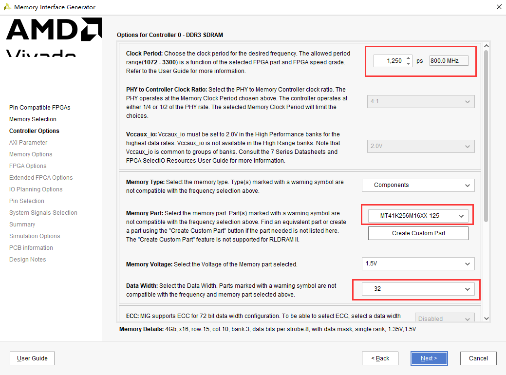
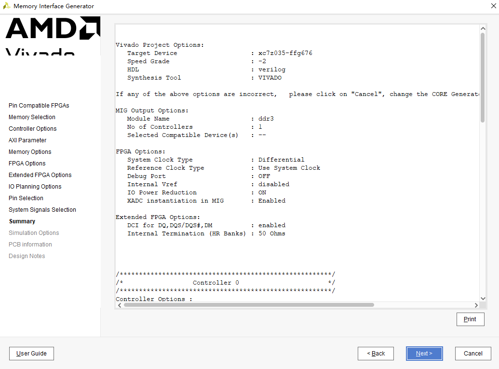

PL端DDR3读写测试实验
======================

**实验VIvado工程为“ddr3_pl_test”。**

硬件介绍
--------

开发板的 PL 端有 2 颗 16bit ddr3，这很大程度方便我们移植以前的FPGA工程到ZYNQ系统中，同时也提供了更大的带宽。

      
Vivado工程建立
--------------

创建一个PL端ddr3测试工程
~~~~~~~~~~~~~~~~~~~~~~~~

      
.. image:: images/16_media/image3.png
      
.. image:: images/16_media/image4.png
      
配置ddr3 IP
~~~~~~~~~~~

1) 在“IP Catalog”的搜索框搜索“mig”，快速找到“Memory Interface Generator”，双击

      
2) 点击“Next”

      
3) “Component Name”修改为“ddr3”，以后我们例化ddr3就可以，点击“Next”

      
4) 点击“Next”

      
5) 控制器类型选择“DDR3 SDRAM”，点击“Next”

      
6) “Memory Part”选择“MT41K256m16XX-125”,“Data Width”选择32

      
7) “Input Clock Period”选择5000ps（200MHz）

.. image:: images/16_media/image11.png
      
8) “System Clock”选择“Differential”,“Reference Clock”选择“Use System Clock”，“System Reset Polarity”选择“ACTIVE LOW”，点击“Next”

.. image:: images/16_media/image12.png
      
9) 使能DCI Cascade，点击“Next”

      
10) 选择“Fixed Pin Out：Pre-existing pin out is konwn and fixed”

      
11) 点击“Read XDC/UCF”

.. image:: images/16_media/image15.png
      
12) 选择ddr.ucf，这里可以选择工程里已经存在的XDC文件，只要包含ddr3的管脚分配信息就可以。

      
13) 点击“Validate”

      
14) 选择sys_clk_p/n为C8/C7，具体可参考核心板原理图BANK34

.. image:: images/16_media/image18.png
      
15) 点击“Next”

      
16) 点击“Access”接受条款

      
17) 点击“Next”

.. image:: images/16_media/image21.png
      
18) 点击“Generate”

.. image:: images/16_media/image22.png
      
19) 在弹出的“Generate Output Products”中选择“Generate”

      
添加其他测试代码
~~~~~~~~~~~~~~~~

其他代码主要功能是读写ddr3并比较数据是否一致，这里不做详细介绍，可参考工程代码。

      
下载调试
--------

生成bit文件以后，使用JTAG下载到开发板，我们可以通过LED来观察ddr3测试情况， LED1 亮表示 ddr3 读写有错误，LED2亮表示ddr3控制器初始化完成，LED3闪烁表示ddr3测试程序在运行。

实验总结
--------

本实验通过PL端Verilog代码直接读写ddr3，通过LED来显示测试结果，我们也可以把ddr3配置成AXI接口，这样方便和ARM系统完成数据交互。
