GTX收发器误码率测试IBERT实验
==============================

**实验VIvado工程为“ibert_test”,目录中还有一个“ibert_ex”，是生成的测试工程。**

Vidado软件为我们提供了强大的误码率测试器IBERT，不但可以测试误码率还能测试眼图，给我们使用高速收发器带来很大的便利，本实验做个抛砖引玉，简单介绍IBERT的使用。

硬件介绍
--------

使用IBERT测试误码率和眼图必须有个收发环通的硬件，开发板上有4个SFP光纤接口，本实验把4个光接口收发两两连接，形成4个收发环通链路。

Vivado工程建立
--------------

1) 新建一个工程名为“ibert_test”

2) 在“IP Catalog”中搜索“ibert”快速找到“IBERT 7 Series GTX”,双击

.. image:: images/17_media/image1.png
      
3) “Component Name”改为“ibert”，LineRate填写10G，Refclk（MHZ）选择125.000

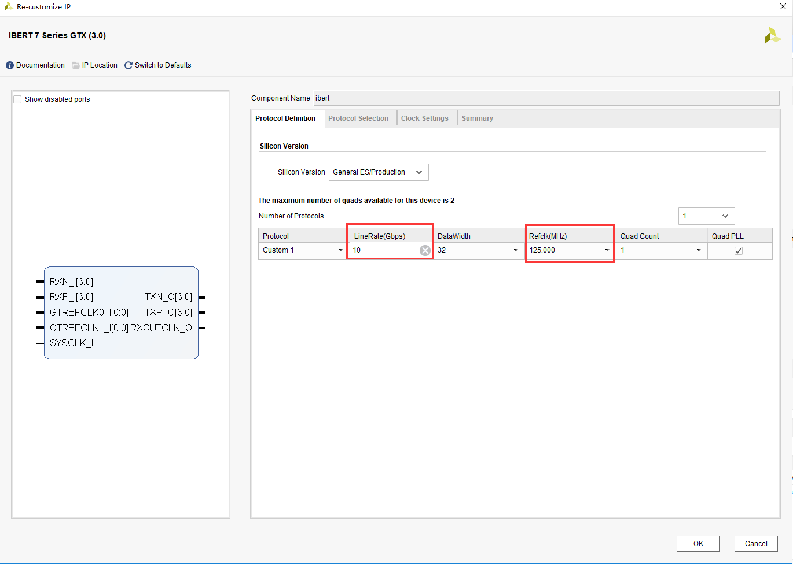
      
4) 在“Protocol Selected”中选择“Custom 1/10Gbps”,“Refclk Selection”选择“MGTREFCLK1 111”

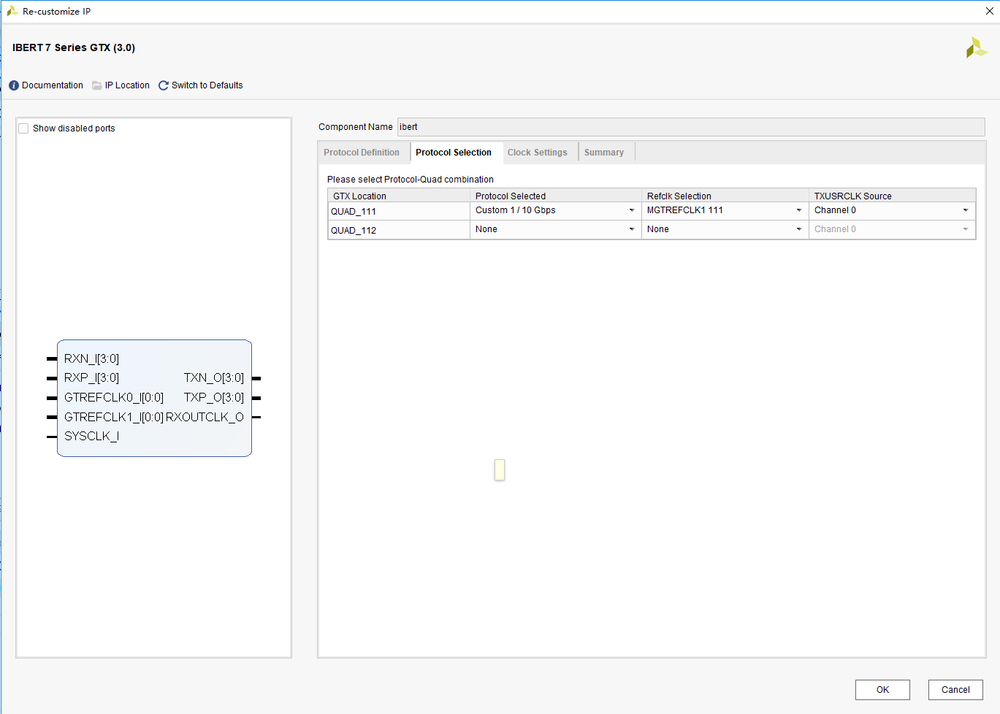
      
5) 在“Clock Settings”页选择“Source”选择“QUAD111 1”,点击“OK”，生成IP核

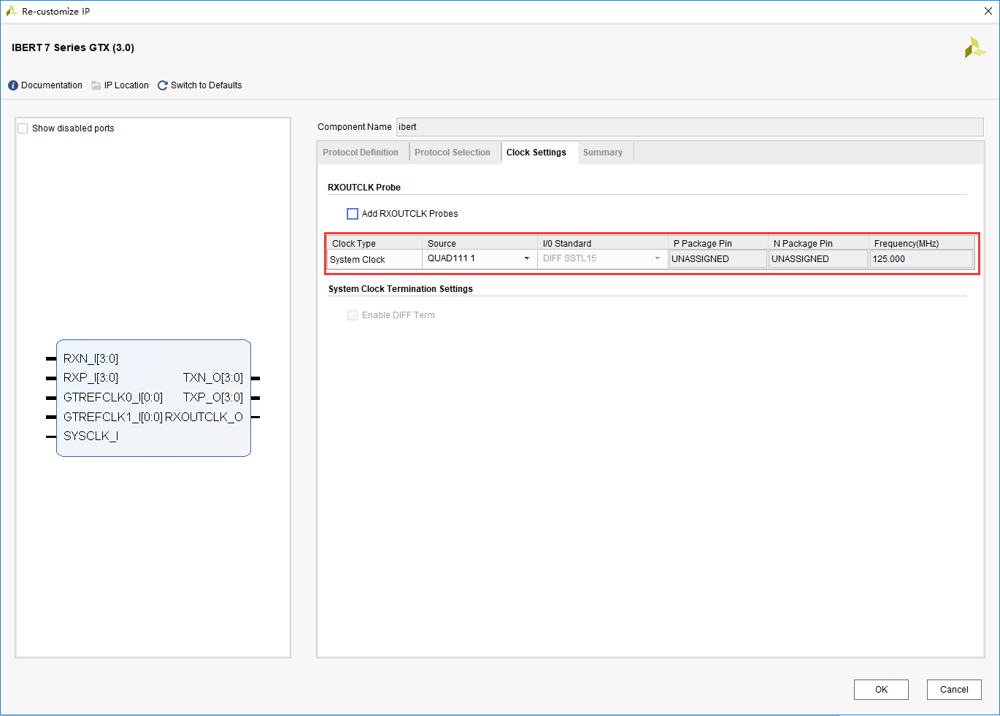
      
6) 生成IP core后等待一段时间后选择IP，右键“Open IP Example Design...”,为IP生成一个测试例程，很多IP都带有测试例程。

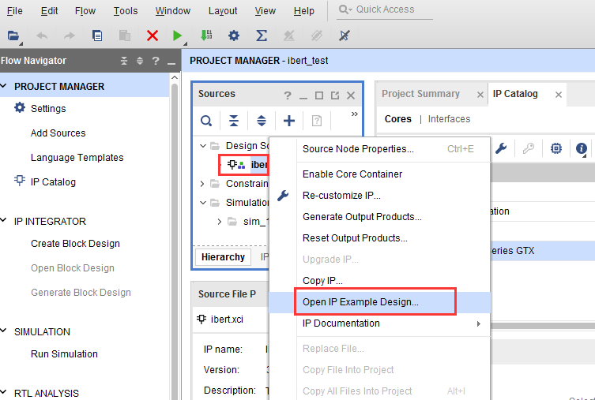
      
7) 选择测试工程的路径，点击“OK”

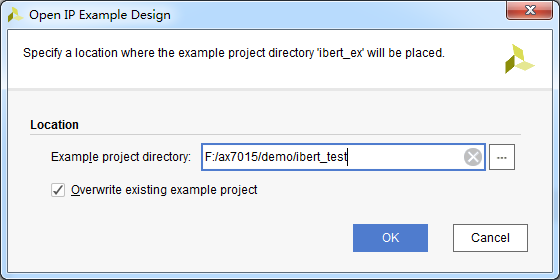
      
8) Vivado会自动生成一个工程并打开，这个例程可能需要我们修改才能正常使用，本实验中添加了SFP光发送使能。

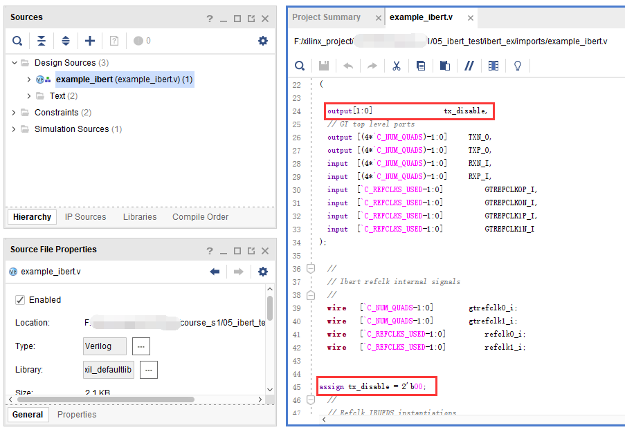
      
9) 添加管脚约束xdc文件

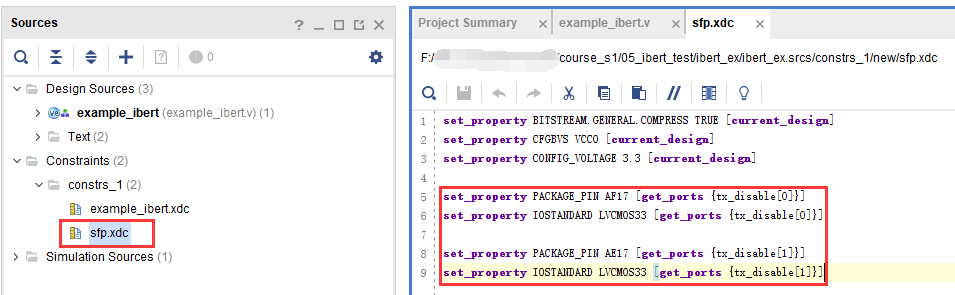
      
编译下载调试
------------

1) 将ibert测试例程编译生成BIT文件

2) 插入光模块，然后使用光纤将4个光口对接，连接好JTAG下载线，给开发板上电

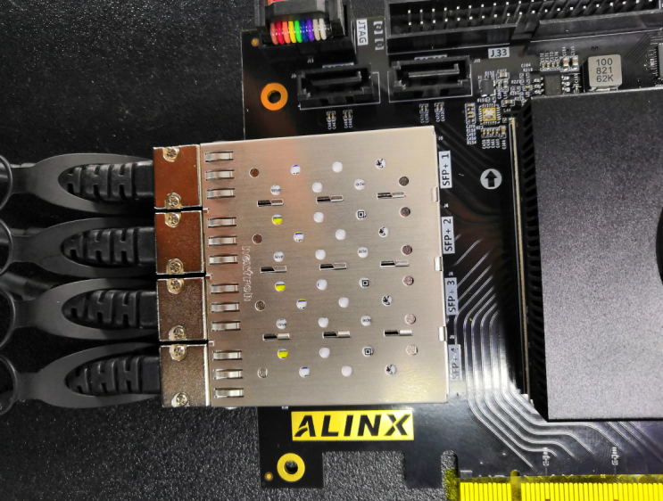
      
3) 使用JTAG下载BIT文件到开发板，可以看到有4个链路锁定，速度10Gbps。

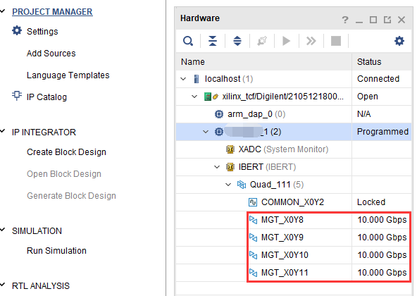
      
4) 选择IBERT，右键，选择“Auto-detect Links”

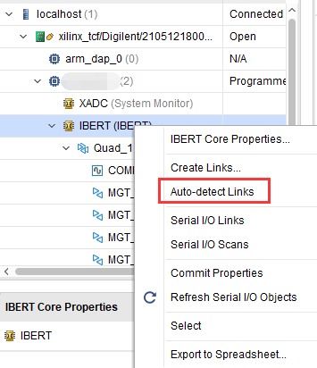
      
5) 点击“Serial I/O Links”,可以看到Errors都是0，如果不是0，可以点击“Reset”，重新开始测试。

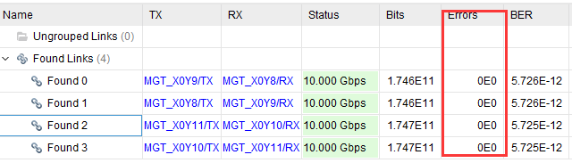
      
6) 选择一个链路，右键“Create Scan...”

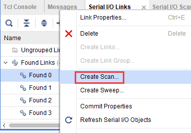
      
7) 默认配置出来的眼图，注意：使用不同的软件版本，测量眼图可能会有差异。

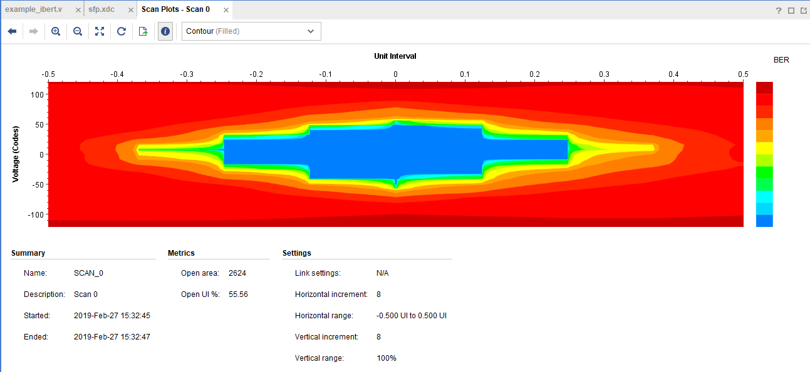
      
实验总结
--------

IBERT提供了强大的调试功能，本实验仅仅展示了部分功能，更详细的使用参考xilinx文档pg132。
