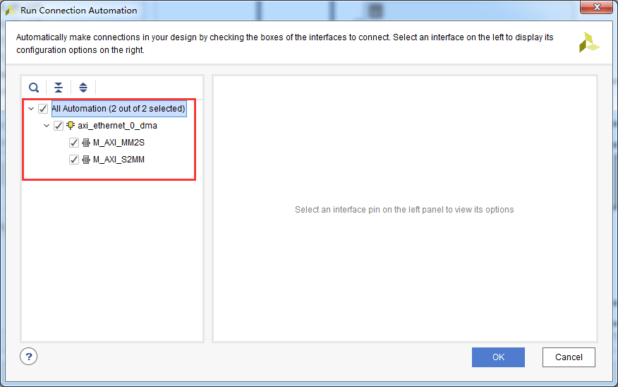
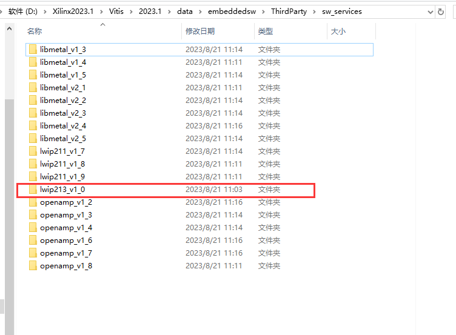
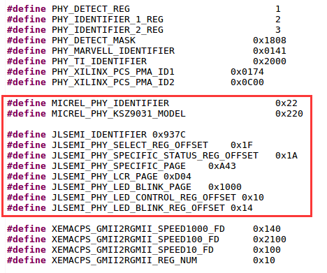

以太网实验（LWIP）
====================

**实验VIvado工程为“net_test”。**

开发板有2路千兆以太网，都是通过RGMII接口连接，其中一路连接到PS端，PS端集成了2个EMAC控制器，可以由ARM直接使用千兆以太网，另外一路接在PL端，可以由FPGA控制，本实验演示如何使用Vitis自带的LWIP模板进行千兆以太网TCP通信。

LWIP虽然是轻量级协议栈，但如果从来没有使用过，使用起来会有一定的困难，建议先熟悉LWIP的相关知识。

Vivado工程建立
--------------

1) 以“ps_hello”另存为一个“net_test”工程，并且勾选中断。详细参数可以参考例程附带的vivado工程。

.. image:: images/05_media/image1.png
      
2) 使能HP0端口，数据位宽为64位

      
PS端的以太网配置
~~~~~~~~~~~~~~~~

1) 使能“Enet0”和“MDIO”

      
选择MDIO

.. image:: images/05_media/image4.png
      
2) 保持Enet0的电平标准为LVCMOS18

      
PL端AXI以太网配置
~~~~~~~~~~~~~~~~~

1) 搜索“eth”，添加一个“AXI 1G/2.5G Ethernet Subsystem”

      
2) 双击刚才添加的模块，修改参数，物理接口选择“RGMII”，其他参数默认

      
3) 点击“Run Block Automation”

.. image:: images/05_media/image8.png
      
4) 选择所有

      
5) 这个时候可以Vivado自动插入了很多模块，点击“Run Connection Automation”自动连线和端口

      
6) 选择所有自动连接

.. image:: images/05_media/image11.png
      
7) 然后一次并没有完成连线，再次点击“Run Connection Automation”

      
8) 选择所有

      
9) 处理中断，搜索“conc”添加“Concat”

      
10) 双击刚添加的模块，修改端口数量为“4”

      
11) 将4个中断信号连接起来

.. image:: images/05_media/image16.png
      
.. image:: images/05_media/image17.png
      
12) 然后和ZYNQ的“IRQ_P2P”接口相连

.. image:: images/05_media/image18.png
      
13) 处理以太网模块参考时钟，以太网模块需要一个200Mhz时钟和一个125Mhz时钟，我们修改为通过外部200Mhz的晶振输入然后通过PLL模块，选择“axi_ethernet_0_refclk”的“clk_in1”脚，右键

.. image:: images/05_media/image19.png
      
14) 选择“Disconnect Pin”

      
15) 双击“axi_ethernet_0_refclk”修改时钟输入频率为200Mhz，Source选择差分

      
16) 然后再选中“CLK_IN1_D”引脚，右键“Make External”

.. image:: images/05_media/image22.png
      
17) 修改“axi_ethernet_0_refclk”的"clk_in1的端口名称为“sys_clk” |image1|

18) 双击sys_clk，将频率改为200MHz

      
19) 修改其他端口的名称

      
20) 创建HDL文件

.. image:: images/05_media/image26.png
      
添加约束文件
~~~~~~~~~~~~

::

 set_property BITSTREAM.GENERAL.COMPRESS TRUE [current_design]
 set_property CONFIG_VOLTAGE 3.3 [current_design]
 set_property CFGBVS VCCO [current_design]
 set_property BITSTREAM.CONFIG.UNUSEDPIN PULLUP [current_design]
 
 ############## clock define##################
 create_clock -period 5.000 [get_ports sys_clk_clk_p]
 set_property PACKAGE_PIN C8 [get_ports sys_clk_clk_p]
 set_property IOSTANDARD DIFF_SSTL15 [get_ports sys_clk_clk_p]
 
 set_property PACKAGE_PIN C13 [get_ports {mdio_mdc          }]
 set_property PACKAGE_PIN D13 [get_ports {mdio_mdio_io      }]
 set_property PACKAGE_PIN A14 [get_ports {phy_rst_n         }]
 set_property PACKAGE_PIN G14  [get_ports {rgmii_rxc         }]
 set_property PACKAGE_PIN F14  [get_ports {rgmii_rx_ctl      }]
 set_property PACKAGE_PIN A13  [get_ports {rgmii_rd[0]       }]
 set_property PACKAGE_PIN A12  [get_ports {rgmii_rd[1]       }]
 set_property PACKAGE_PIN B12  [get_ports {rgmii_rd[2]       }]
 set_property PACKAGE_PIN C12  [get_ports {rgmii_rd[3]       }]
 set_property PACKAGE_PIN C11  [get_ports {rgmii_txc         }]
 set_property PACKAGE_PIN B11  [get_ports {rgmii_tx_ctl      }]
 set_property PACKAGE_PIN E10  [get_ports {rgmii_td[0]       }]
 set_property PACKAGE_PIN D10  [get_ports {rgmii_td[1]       }]
 set_property PACKAGE_PIN F13  [get_ports {rgmii_td[2]       }]
 set_property PACKAGE_PIN E13  [get_ports {rgmii_td[3]       }]
 
 set_property IOSTANDARD LVCMOS18 [get_ports {mdio_mdc          }]
 set_property IOSTANDARD LVCMOS18 [get_ports {mdio_mdio_io      }]
 set_property IOSTANDARD LVCMOS18 [get_ports {phy_rst_n         }]
 set_property IOSTANDARD LVCMOS18 [get_ports {rgmii_rxc         }]
 set_property IOSTANDARD LVCMOS18 [get_ports {rgmii_rx_ctl      }]
 set_property IOSTANDARD LVCMOS18 [get_ports {rgmii_rd[0]       }]
 set_property IOSTANDARD LVCMOS18 [get_ports {rgmii_rd[1]       }]
 set_property IOSTANDARD LVCMOS18 [get_ports {rgmii_rd[2]       }]
 set_property IOSTANDARD LVCMOS18 [get_ports {rgmii_rd[3]       }]
 set_property IOSTANDARD LVCMOS18 [get_ports {rgmii_txc         }]
 set_property IOSTANDARD LVCMOS18 [get_ports {rgmii_tx_ctl      }]
 set_property IOSTANDARD LVCMOS18 [get_ports {rgmii_td[0]       }]
 set_property IOSTANDARD LVCMOS18 [get_ports {rgmii_td[1]       }]
 set_property IOSTANDARD LVCMOS18 [get_ports {rgmii_td[2]       }]
 set_property IOSTANDARD LVCMOS18 [get_ports {rgmii_td[3]       }]

1)  编译生成bit文件，然后导出硬件信息，启动Vitis

Vitis程序
---------

LWIP库修改
~~~~~~~~~~

由于自带的LWIP库只能识别部分phy芯片，如果开发板所用的phy芯片不在默认支持范围内，要修改库文件。也可以直接使用修改过的库替换原有的库。

1) 找到库文件目录“D:\\Xilinx2023.1\\Vitis\\2023.1\\data\\embeddedsw\\ThirdParty\\sw_services”

      
2) 找到要修改的文件目录“lwip213_v1_0\\src\\contrib\\ports\\xilinx\\netif”中文件“xaxiemacif_physpeed.c”和“xemacpsif_physpeed.c”要修改。

.. image:: images/05_media/image28.png
      
3) 修改“xaxiemacif_physpeed.c”文件，添加相关宏定义

.. image:: images/05_media/image29.png
      
4) 添加phy速度获取函数

.. code:: c

 unsigned int get_phy_speed_ksz9031(XAxiEthernet *xaxiemacp, u32 phy_addr)
 {
 	u16 control;
 	u16 status;
 	u16 partner_capabilities;
 	xil_printf("Start PHY autonegotiation \r\n");
 
 	XAxiEthernet_PhyWrite(xaxiemacp,phy_addr, IEEE_PAGE_ADDRESS_REGISTER, 2);
 	XAxiEthernet_PhyRead(xaxiemacp, phy_addr, IEEE_CONTROL_REG_MAC, &control);
 	//control |= IEEE_RGMII_TXRX_CLOCK_DELAYED_MASK;
 	control &= ~(0x10);
 	XAxiEthernet_PhyWrite(xaxiemacp, phy_addr, IEEE_CONTROL_REG_MAC, control);
 
 	XAxiEthernet_PhyWrite(xaxiemacp, phy_addr, IEEE_PAGE_ADDRESS_REGISTER, 0);
 
 	XAxiEthernet_PhyRead(xaxiemacp, phy_addr, IEEE_AUTONEGO_ADVERTISE_REG, &control);
 	control |= IEEE_ASYMMETRIC_PAUSE_MASK;
 	control |= IEEE_PAUSE_MASK;
 	control |= ADVERTISE_100;
 	control |= ADVERTISE_10;
 	XAxiEthernet_PhyWrite(xaxiemacp, phy_addr, IEEE_AUTONEGO_ADVERTISE_REG, control);
 
 	XAxiEthernet_PhyRead(xaxiemacp, phy_addr, IEEE_1000_ADVERTISE_REG_OFFSET,
 																	&control);
 	control |= ADVERTISE_1000;
 	XAxiEthernet_PhyWrite(xaxiemacp, phy_addr, IEEE_1000_ADVERTISE_REG_OFFSET,
 																	control);
 
 	XAxiEthernet_PhyWrite(xaxiemacp, phy_addr, IEEE_PAGE_ADDRESS_REGISTER, 0);
 	XAxiEthernet_PhyRead(xaxiemacp, phy_addr, IEEE_COPPER_SPECIFIC_CONTROL_REG,
 																&control);
 	control |= (7 << 12);	/* max number of gigabit attempts */
 	control |= (1 << 11);	/* enable downshift */
 	XAxiEthernet_PhyWrite(xaxiemacp, phy_addr, IEEE_COPPER_SPECIFIC_CONTROL_REG,
 																control);
 	XAxiEthernet_PhyRead(xaxiemacp, phy_addr, IEEE_CONTROL_REG_OFFSET, &control);
 	control |= IEEE_CTRL_AUTONEGOTIATE_ENABLE;
 	control |= IEEE_STAT_AUTONEGOTIATE_RESTART;
 
 	XAxiEthernet_PhyWrite(xaxiemacp, phy_addr, IEEE_CONTROL_REG_OFFSET, control);
 
 	XAxiEthernet_PhyRead(xaxiemacp, phy_addr, IEEE_CONTROL_REG_OFFSET, &control);
 	control |= IEEE_CTRL_RESET_MASK;
 	XAxiEthernet_PhyWrite(xaxiemacp, phy_addr, IEEE_CONTROL_REG_OFFSET, control);
 
 	while (1) {
 		XAxiEthernet_PhyRead(xaxiemacp, phy_addr, IEEE_CONTROL_REG_OFFSET, &control);
 		if (control & IEEE_CTRL_RESET_MASK)
 			continue;
 		else
 			break;
 	}
 	xil_printf("Waiting for PHY to complete autonegotiation.\r\n");
 
 	XAxiEthernet_PhyRead(xaxiemacp, phy_addr, IEEE_STATUS_REG_OFFSET, &status);
 	while ( !(status & IEEE_STAT_AUTONEGOTIATE_COMPLETE) ) {
 		sleep(1);
 		XAxiEthernet_PhyRead(xaxiemacp, phy_addr, IEEE_STATUS_REG_OFFSET,
 																&status);
 		}
 
 	xil_printf("autonegotiation complete \r\n");
 
 	XAxiEthernet_PhyRead(xaxiemacp, phy_addr, 0x1f, &partner_capabilities);
 
 	if ( (partner_capabilities & 0x40) == 0x40)/* 1000Mbps */
 		return 1000;
 	else if ( (partner_capabilities & 0x20) == 0x20)/* 100Mbps */
 		return 100;
 	else if ( (partner_capabilities & 0x10) == 0x10)/* 10Mbps */
 		return 10;
 	else
 		return 0;
 }
 static u32_t get_phy_speed_JL2121(XAxiEthernet *xaxiemacp, u32_t phy_addr)
 {
 	u16_t temp;
 	u16_t control;
 	u16_t status;
 	u16_t status_speed;
 	u32_t timeout_counter = 0;
 	u32_t temp_speed;
 	u32_t phyregtemp;
 
 	xil_printf("phy is JL2121!\r\n");
 
 
 	xil_printf("Start PHY autonegotiation \r\n");
 
 	XAxiEthernet_PhyRead(xaxiemacp, phy_addr, IEEE_CONTROL_REG_OFFSET, &control);
 	control |= IEEE_CTRL_RESET_MASK;
 	XAxiEthernet_PhyWrite(xaxiemacp, phy_addr, IEEE_CONTROL_REG_OFFSET, control);
 
 	usleep(10000);
 
 	XAxiEthernet_PhyRead(xaxiemacp, phy_addr, IEEE_AUTONEGO_ADVERTISE_REG, &control);
 	control |= IEEE_ASYMMETRIC_PAUSE_MASK;
 	control |= IEEE_PAUSE_MASK;
 	control |= ADVERTISE_100;
 	control |= ADVERTISE_10;
 	XAxiEthernet_PhyWrite(xaxiemacp, phy_addr, IEEE_AUTONEGO_ADVERTISE_REG, control);
 
 	XAxiEthernet_PhyRead(xaxiemacp, phy_addr, IEEE_1000_ADVERTISE_REG_OFFSET,
 					&control);
 	control |= ADVERTISE_1000;
 	XAxiEthernet_PhyWrite(xaxiemacp, phy_addr, IEEE_1000_ADVERTISE_REG_OFFSET,
 					control);
 
 	XAxiEthernet_PhyRead(xaxiemacp, phy_addr, IEEE_CONTROL_REG_OFFSET, &control);
 	control |= IEEE_CTRL_AUTONEGOTIATE_ENABLE;
 	control |= IEEE_STAT_AUTONEGOTIATE_RESTART;
 	XAxiEthernet_PhyWrite(xaxiemacp, phy_addr, IEEE_CONTROL_REG_OFFSET, control);
 
 
 
 	while (1) {
 		XAxiEthernet_PhyRead(xaxiemacp, phy_addr, IEEE_CONTROL_REG_OFFSET, &control);
 		if (control & IEEE_CTRL_RESET_MASK)
 			continue;
 		else
 			break;
 	}
 
 	XAxiEthernet_PhyRead(xaxiemacp, phy_addr, IEEE_STATUS_REG_OFFSET, &status);
 
 	xil_printf("Waiting for PHY to complete autonegotiation.\r\n");
 
 	while ( !(status & IEEE_STAT_AUTONEGOTIATE_COMPLETE) ) {
 		sleep(1);
 
 		timeout_counter++;
 
 		if (timeout_counter == 30) {
 			xil_printf("Auto negotiation error \r\n");
 			return;
 		}
 		XAxiEthernet_PhyRead(xaxiemacp, phy_addr, IEEE_STATUS_REG_OFFSET, &status);
 	}
 	xil_printf("autonegotiation complete \r\n");
 
 
 	XAxiEthernet_PhyWrite(xaxiemacp, phy_addr,JLSEMI_PHY_SELECT_REG_OFFSET,JLSEMI_PHY_SPECIFIC_PAGE);
 	XAxiEthernet_PhyRead(xaxiemacp,  phy_addr, JLSEMI_PHY_SPECIFIC_STATUS_REG_OFFSET, &status_speed);
 
 	XAxiEthernet_PhyWrite(xaxiemacp, phy_addr,JLSEMI_PHY_SELECT_REG_OFFSET,JLSEMI_PHY_LCR_PAGE);
 	XAxiEthernet_PhyWrite(xaxiemacp, phy_addr,JLSEMI_PHY_LED_CONTROL_REG_OFFSET,0xAE01);
 
 	XAxiEthernet_PhyWrite(xaxiemacp, phy_addr,JLSEMI_PHY_SELECT_REG_OFFSET,JLSEMI_PHY_LED_BLINK_PAGE);
 	XAxiEthernet_PhyWrite(xaxiemacp, phy_addr,JLSEMI_PHY_LED_BLINK_REG_OFFSET,0x0704);
 	XAxiEthernet_PhyWrite(xaxiemacp, phy_addr,JLSEMI_PHY_SELECT_REG_OFFSET,0);
 
 	if ( (status_speed & 0x20) == 0x20)/* 1000Mbps */
 		return 1000;
 	else if ( (status_speed & 0x10) == 0x10)/* 100Mbps */
 		return 100;
 	else if ( (status_speed & 0x30) == 0x0)/* 10Mbps */
 		return 10;
 	else
 		return 0;
 	return XST_SUCCESS;
 }

5) 修改函数“get_IEEE_phy_speed”，添加对KSZ9031和JL2121的支持。

.. code:: c

 unsigned get_IEEE_phy_speed(XAxiEthernet *xaxiemacp)
 {
 	u16 phy_identifier;
 	u16 phy_model;
 	u8 phytype;
 
 #ifdef XPAR_AXIETHERNET_0_BASEADDR
 	u32 phy_addr = detect_phy(xaxiemacp);
 
 	/* Get the PHY Identifier and Model number */
 	XAxiEthernet_PhyRead(xaxiemacp, phy_addr, PHY_IDENTIFIER_1_REG, &phy_identifier);
 	XAxiEthernet_PhyRead(xaxiemacp, phy_addr, PHY_IDENTIFIER_2_REG, &phy_model);
 
 /* Depending upon what manufacturer PHY is connected, a different mask is
  * needed to determine the specific model number of the PHY. */
 	if (phy_identifier == MARVEL_PHY_IDENTIFIER) {
 		phy_model = phy_model & MARVEL_PHY_MODEL_NUM_MASK;
 
 		if (phy_model == MARVEL_PHY_88E1116R_MODEL) {
 			return get_phy_speed_88E1116R(xaxiemacp, phy_addr);
 		} else if (phy_model == MARVEL_PHY_88E1111_MODEL) {
 			return get_phy_speed_88E1111(xaxiemacp, phy_addr);
 		}
 	} else if (phy_identifier == TI_PHY_IDENTIFIER) {
 		phy_model = phy_model & TI_PHY_DP83867_MODEL;
 		phytype = XAxiEthernet_GetPhysicalInterface(xaxiemacp);
 
 		if (phy_model == TI_PHY_DP83867_MODEL && phytype == XAE_PHY_TYPE_SGMII) {
 			return get_phy_speed_TI_DP83867_SGMII(xaxiemacp, phy_addr);
 		}
 
 		if (phy_model == TI_PHY_DP83867_MODEL) {
 			return get_phy_speed_TI_DP83867(xaxiemacp, phy_addr);
 		}
 	}
 	else if(phy_identifier == MICREL_PHY_IDENTIFIER)
 	{
 		xil_printf("Phy %d is KSZ9031\n\r", phy_addr);
 		return get_phy_speed_ksz9031(xaxiemacp, phy_addr);
 	}
 	else if(phy_identifier == JLSEMI_IDENTIFIER)
 	{
 		return get_phy_speed_JL2121(xaxiemacp, phy_addr);
 	}
 	else {
 	    LWIP_DEBUGF(NETIF_DEBUG, ("XAxiEthernet get_IEEE_phy_speed: Detected PHY with unknown identifier/model.\r\n"));
 	}
 #endif
 #ifdef PCM_PMA_CORE_PRESENT
 	return get_phy_negotiated_speed(xaxiemacp, phy_addr);
 #endif
 }

6) 修改“xemacpsif_physpeed.c”文件添加宏定义

      
7) 添加phy速度获取函数

.. code:: c

 static u32_t get_phy_speed_ksz9031(XEmacPs *xemacpsp, u32_t phy_addr)
 {
 	u16_t temp;
 	u16_t control;
 	u16_t status;
 	u16_t status_speed;
 	u32_t timeout_counter = 0;
 	u32_t temp_speed;
 	u32_t phyregtemp;
 
 	xil_printf("Start PHY autonegotiation \r\n");
 
 	XEmacPs_PhyWrite(xemacpsp,phy_addr, IEEE_PAGE_ADDRESS_REGISTER, 2);
 	XEmacPs_PhyRead(xemacpsp, phy_addr, IEEE_CONTROL_REG_MAC, &control);
 	control |= IEEE_RGMII_TXRX_CLOCK_DELAYED_MASK;
 	XEmacPs_PhyWrite(xemacpsp, phy_addr, IEEE_CONTROL_REG_MAC, control);
 
 	XEmacPs_PhyWrite(xemacpsp, phy_addr, IEEE_PAGE_ADDRESS_REGISTER, 0);
 
 	XEmacPs_PhyRead(xemacpsp, phy_addr, IEEE_AUTONEGO_ADVERTISE_REG, &control);
 	control |= IEEE_ASYMMETRIC_PAUSE_MASK;
 	control |= IEEE_PAUSE_MASK;
 	control |= ADVERTISE_100;
 	control |= ADVERTISE_10;
 	XEmacPs_PhyWrite(xemacpsp, phy_addr, IEEE_AUTONEGO_ADVERTISE_REG, control);
 
 	XEmacPs_PhyRead(xemacpsp, phy_addr, IEEE_1000_ADVERTISE_REG_OFFSET,
 					&control);
 	control |= ADVERTISE_1000;
 	XEmacPs_PhyWrite(xemacpsp, phy_addr, IEEE_1000_ADVERTISE_REG_OFFSET,
 					control);
 
 	XEmacPs_PhyWrite(xemacpsp, phy_addr, IEEE_PAGE_ADDRESS_REGISTER, 0);
 	XEmacPs_PhyRead(xemacpsp, phy_addr, IEEE_COPPER_SPECIFIC_CONTROL_REG,
 																&control);
 	control |= (7 << 12);	/* max number of gigabit attempts */
 	control |= (1 << 11);	/* enable downshift */
 	XEmacPs_PhyWrite(xemacpsp, phy_addr, IEEE_COPPER_SPECIFIC_CONTROL_REG,
 																control);
 	XEmacPs_PhyRead(xemacpsp, phy_addr, IEEE_CONTROL_REG_OFFSET, &control);
 	control |= IEEE_CTRL_AUTONEGOTIATE_ENABLE;
 	control |= IEEE_STAT_AUTONEGOTIATE_RESTART;
 	XEmacPs_PhyWrite(xemacpsp, phy_addr, IEEE_CONTROL_REG_OFFSET, control);
 
 	XEmacPs_PhyRead(xemacpsp, phy_addr, IEEE_CONTROL_REG_OFFSET, &control);
 	control |= IEEE_CTRL_RESET_MASK;
 	XEmacPs_PhyWrite(xemacpsp, phy_addr, IEEE_CONTROL_REG_OFFSET, control);
 
 	while (1) {
 		XEmacPs_PhyRead(xemacpsp, phy_addr, IEEE_CONTROL_REG_OFFSET, &control);
 		if (control & IEEE_CTRL_RESET_MASK)
 			continue;
 		else
 			break;
 	}
 
 	XEmacPs_PhyRead(xemacpsp, phy_addr, IEEE_STATUS_REG_OFFSET, &status);
 
 	xil_printf("Waiting for PHY to complete autonegotiation.\r\n");
 
 	while ( !(status & IEEE_STAT_AUTONEGOTIATE_COMPLETE) ) {
 		sleep(1);
 		XEmacPs_PhyRead(xemacpsp, phy_addr,
 						IEEE_COPPER_SPECIFIC_STATUS_REG_2,  &temp);
 		timeout_counter++;
 
 		if (timeout_counter == 30) {
 			xil_printf("Auto negotiation error \r\n");
 			return;
 		}
 		XEmacPs_PhyRead(xemacpsp, phy_addr, IEEE_STATUS_REG_OFFSET, &status);
 	}
 	xil_printf("autonegotiation complete \r\n");
 
 	XEmacPs_PhyRead(xemacpsp, phy_addr,0x1f,
 					&status_speed);
 
 	if ( (status_speed & 0x40) == 0x40)/* 1000Mbps */
 		return 1000;
 	else if ( (status_speed & 0x20) == 0x20)/* 100Mbps */
 		return 100;
 	else if ( (status_speed & 0x10) == 0x10)/* 10Mbps */
 		return 10;
 	else
 		return 0;
 	return XST_SUCCESS;
 }
 static u32_t get_phy_speed_JL2121(XEmacPs *xemacpsp, u32_t phy_addr)
 {
 	u16_t temp;
 	u16_t control;
 	u16_t status;
 	u16_t status_speed;
 	u32_t timeout_counter = 0;
 	u32_t temp_speed;
 	u32_t phyregtemp;
 
 	xil_printf("phy is JL2121!\r\n");
 
 
 	xil_printf("Start PHY autonegotiation \r\n");
 
 	XEmacPs_PhyRead(xemacpsp, phy_addr, IEEE_CONTROL_REG_OFFSET, &control);
 	control |= IEEE_CTRL_RESET_MASK;
 	XEmacPs_PhyWrite(xemacpsp, phy_addr, IEEE_CONTROL_REG_OFFSET, control);
 
 	usleep(10000);
 
 	XEmacPs_PhyRead(xemacpsp, phy_addr, IEEE_AUTONEGO_ADVERTISE_REG, &control);
 	control |= IEEE_ASYMMETRIC_PAUSE_MASK;
 	control |= IEEE_PAUSE_MASK;
 	control |= ADVERTISE_100;
 	control |= ADVERTISE_10;
 	XEmacPs_PhyWrite(xemacpsp, phy_addr, IEEE_AUTONEGO_ADVERTISE_REG, control);
 
 	XEmacPs_PhyRead(xemacpsp, phy_addr, IEEE_1000_ADVERTISE_REG_OFFSET,
 					&control);
 	control |= ADVERTISE_1000;
 	XEmacPs_PhyWrite(xemacpsp, phy_addr, IEEE_1000_ADVERTISE_REG_OFFSET,
 					control);
 
 	XEmacPs_PhyRead(xemacpsp, phy_addr, IEEE_CONTROL_REG_OFFSET, &control);
 	control |= IEEE_CTRL_AUTONEGOTIATE_ENABLE;
 	control |= IEEE_STAT_AUTONEGOTIATE_RESTART;
 	XEmacPs_PhyWrite(xemacpsp, phy_addr, IEEE_CONTROL_REG_OFFSET, control);
 
 
 
 	while (1) {
 		XEmacPs_PhyRead(xemacpsp, phy_addr, IEEE_CONTROL_REG_OFFSET, &control);
 		if (control & IEEE_CTRL_RESET_MASK)
 			continue;
 		else
 			break;
 	}
 
 	XEmacPs_PhyRead(xemacpsp, phy_addr, IEEE_STATUS_REG_OFFSET, &status);
 
 	xil_printf("Waiting for PHY to complete autonegotiation.\r\n");
 
 	while ( !(status & IEEE_STAT_AUTONEGOTIATE_COMPLETE) ) {
 		sleep(1);
 
 		timeout_counter++;
 
 		if (timeout_counter == 30) {
 			xil_printf("Auto negotiation error \r\n");
 			return;
 		}
 		XEmacPs_PhyRead(xemacpsp, phy_addr, IEEE_STATUS_REG_OFFSET, &status);
 	}
 	xil_printf("autonegotiation complete \r\n");
 
 
 	XEmacPs_PhyWrite(xemacpsp, phy_addr,JLSEMI_PHY_SELECT_REG_OFFSET,JLSEMI_PHY_SPECIFIC_PAGE);
 	XEmacPs_PhyRead(xemacpsp,  phy_addr, JLSEMI_PHY_SPECIFIC_STATUS_REG_OFFSET, &status_speed);
 
 	XEmacPs_PhyWrite(xemacpsp, phy_addr,JLSEMI_PHY_SELECT_REG_OFFSET,JLSEMI_PHY_LCR_PAGE);
 	XEmacPs_PhyWrite(xemacpsp, phy_addr,JLSEMI_PHY_LED_CONTROL_REG_OFFSET,0xAE01);
 
 	XEmacPs_PhyWrite(xemacpsp, phy_addr,JLSEMI_PHY_SELECT_REG_OFFSET,JLSEMI_PHY_LED_BLINK_PAGE);
 	XEmacPs_PhyWrite(xemacpsp, phy_addr,JLSEMI_PHY_LED_BLINK_REG_OFFSET,0x0704);
 	XEmacPs_PhyWrite(xemacpsp, phy_addr,JLSEMI_PHY_SELECT_REG_OFFSET,0);
 
 	if ( (status_speed & 0x20) == 0x20)/* 1000Mbps */
 		return 1000;
 	else if ( (status_speed & 0x10) == 0x10)/* 100Mbps */
 		return 100;
 	else if ( (status_speed & 0x30) == 0x0)/* 10Mbps */
 		return 10;
 	else
 		return 0;
 	return XST_SUCCESS;
 }

8) 修改函数“get_IEEE_phy_speed”，添加对KSZ9031和JL2121的支持

.. code:: c

 static u32_t get_IEEE_phy_speed(XEmacPs *xemacpsp, u32_t phy_addr)
 {
 	u16_t phy_identity;
 	u32_t RetStatus;
 
 	XEmacPs_PhyRead(xemacpsp, phy_addr, PHY_IDENTIFIER_1_REG,
 					&phy_identity);
 	
 	if(phy_identity == MICREL_PHY_IDENTIFIER)
 	{
 		RetStatus = get_phy_speed_ksz9031(xemacpsp, phy_addr);
 	}else if (phy_identity == JLSEMI_IDENTIFIER) {
 		RetStatus = get_phy_speed_JL2121(xemacpsp, phy_addr);
 	}
 	else if (phy_identity == PHY_TI_IDENTIFIER) {
 		RetStatus = get_TI_phy_speed(xemacpsp, phy_addr);
 	} else {
 		RetStatus = get_Marvell_phy_speed(xemacpsp, phy_addr);
 	}
 
 	return RetStatus;
 }

创建基于LWIP模板的APP
~~~~~~~~~~~~~~~~~~~~~

      
下载调试
--------

如果系统中既有PS以太网控制器，又有PL端AXI以太网控制器，LWIP模板默认会选择PL端AXI以太网控制器，我们先测试PL端以太网，测试环境要求有一台支持dhcp的路由器，开发板连接路由器可以自动获取IP地址，实验主机和开发板在一个网络，可以相互通信。

PL端以太网测试
~~~~~~~~~~~~~~

1) 连接串口打开串口调试终端，连接好PL端以太网网线到路由器（ETH2）

2) 运行Vitis

      
3) 可以看到串口打印出一些信息，可以看到自动获取到地址为“192.168.1.68”，连接速度1000Mbps，tcp端口为7

      
4) 使用telnet连接

.. image:: images/05_media/image34.png
      
5) 当输入一个字符时，开发板返回相同字符

      
PS端以太网测试
~~~~~~~~~~~~~~

1) 修改BSP设置

      
2) “use_axieth_on_zynq”修改为0，使用PS以太网

      
3) 修改“platform_config.h”文件

      
4) 网线连接PS端以太网到路由器

5) 运行程序，观察串口输出

      
实验总结
--------

通过实验我们更加深刻了解到Vitis程序的开发，通过简单修改例程已经不能满足需求，有时候还要修改库文件。

      