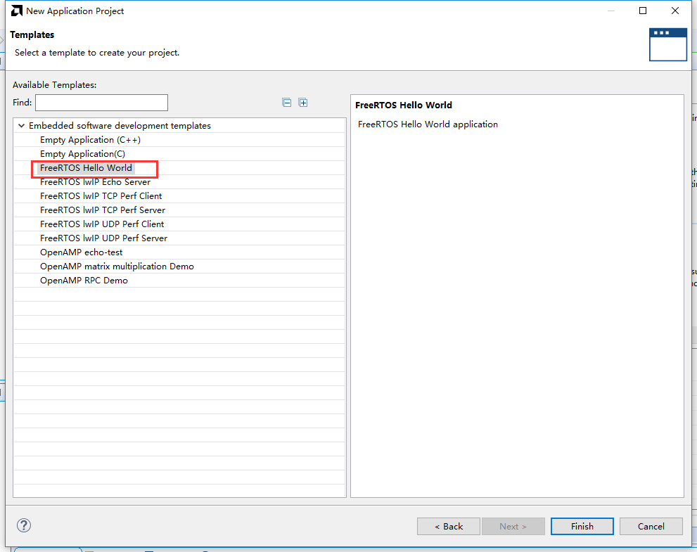
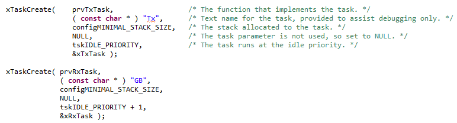
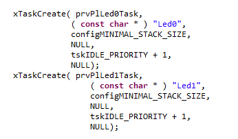
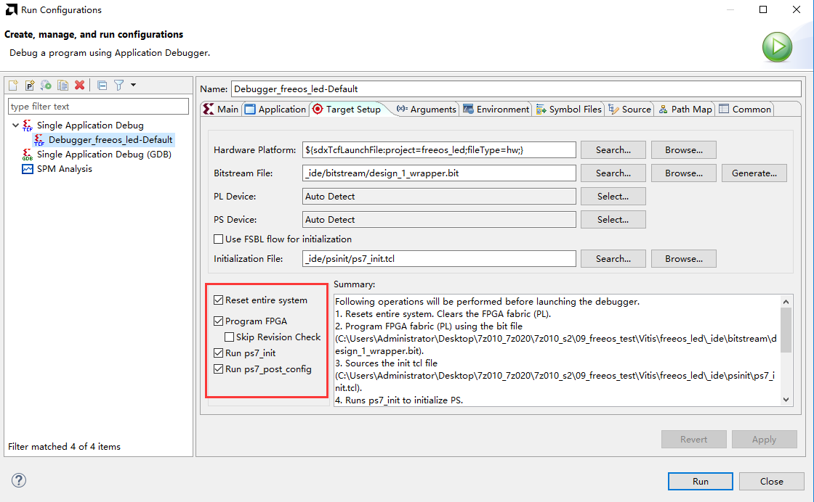
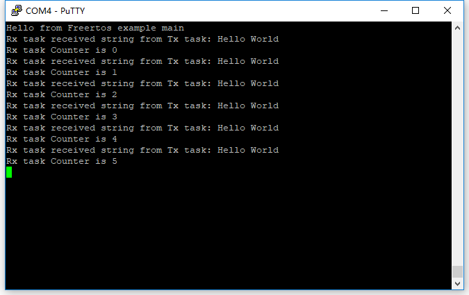

ZYNQ下使用Free RTOS
=====================

学习
ZYNQ，很大一部分都是FPGA开发人员，不太擅长使用Linux，所以我建议大家还

是先使用实时操作系统或者裸机运行，这样也有更大的灵活性。本章给大家讲解如何搭建

Free RTOS实时操作系统运行环境，这里不深入探讨Free RTOS的具体使用。本实验以FreeRTOS Hello World做举例，并实验PL端的LED1和LED2以不同间隔持续闪烁。

本实验基于“双核AMP的使用”教程，硬件环境不需要修改。

Vitis程序开发
-------------

1. 新建工程，OS Platform选择freertos10_xilinx

.. image:: images/10_media/image1.png
      
2. 本实验选择FreeRTOS Hello World做举例

      
Hello World例子中建立了两个任务，发送任务和接收任务，接收任务的优先级高于发送任务。并且创建队列，由发送任务向队列发送数据，接收任务从队列中读取数据并打印。例子中设设置了timer，但在本实验中删除了timer，让发送和接收任务一直工作。

      
3. 在此基础上增加PS和PL端LED闪烁任务，PS端闪烁间隔为100ms，PL端闪烁间隔为1S

      
板上验证
--------

1. 下载界面设置，下载程序

      
2. 打开putty，正在持续打印数据

      
3. 同时也能看到开发板上LED1和LED2闪烁，直观地体现了多任务并行处理。

本章小结
--------

相对于复杂的Linux，FreeRTOS 等实时操作系统给我们带来更灵活更方便的开发，可以更直接的和底层FPGA进行交互，但是FreeRTOS本身也有一点难度，要想熟练应用，还是要结合具体的项目多加练习。
