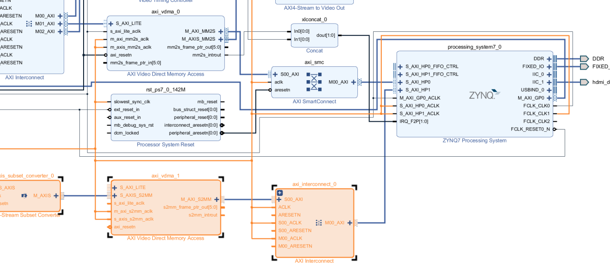
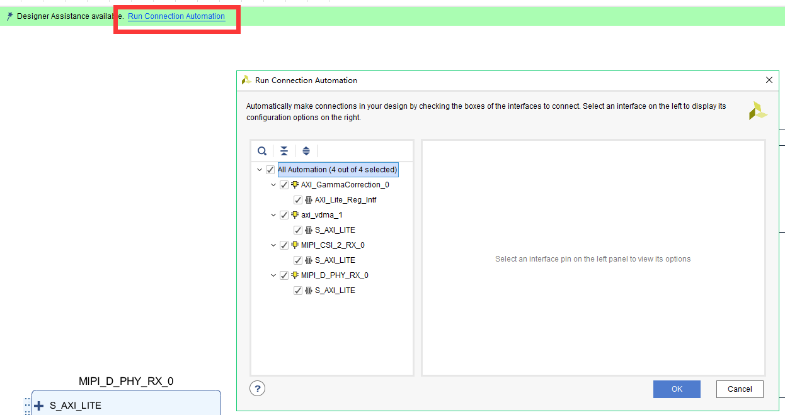
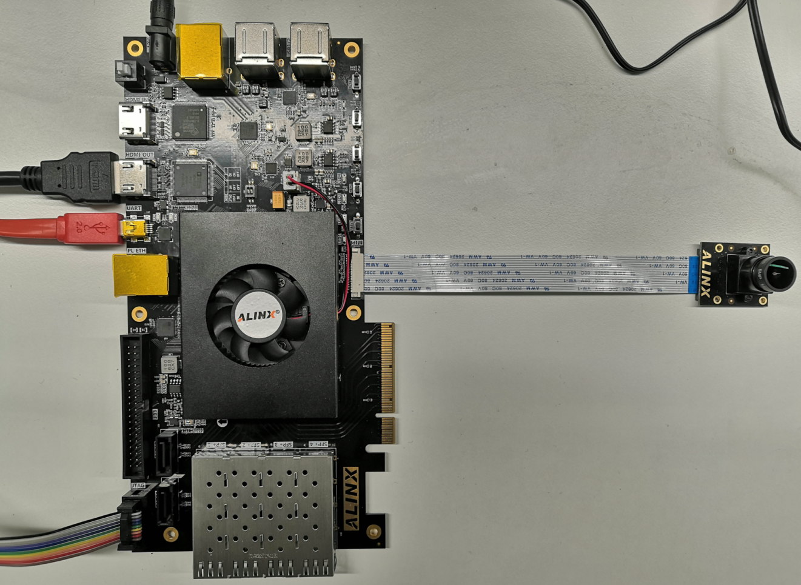

基于AN5641模块的MIPI采集显示
==============================

**实验Vivado工程为“an5641_mipi_hdmi”。**

在前面的章节中介绍了利用摄像头的DVP接口进行图像采集的实验，本章介绍基于AN5641模块的MIPI
CSI-2图像采集。MIPI协议比较复杂，本章旨在介绍基础的概念，待用户深入学习。

原理介绍
--------

MIPI联盟，即移动产业处理接口（Mobile Industry Processor
Interface）联盟，MIPI联盟制定了一整套的接口标准，将移动设备的接口，比如摄像头、显示屏等接口标准化。用于摄像头采集的称为CSI接口，用于显示的称为DSI。由于是摄像头，所以我们要学习的是CSI接口。CSI接口又分为物理层（D-PHY）和协议层（CSI-2）。

MIPI物理层(D-PHY)
~~~~~~~~~~~~~~~~~

以下为物理层的结构图，Dp/Dn为差分接口，接口部分又分为LP（low
power），顾名思义，即低功耗模式，可控制接口进入sleep状态，或者进行状态的切换，电压摆幅1.2V；HS(high
speed)，即高速接口，主要用于图像的传输，电压摆幅200mV。而D-PHY的主要作用就是进行模式的切换，以及将数据串行转为并行。

具体内容可以参考工程目录下面的\ *mipi_D-PHY_specification_v01-00-00.pdf*

      
MIPI协议层(CSI-2)
~~~~~~~~~~~~~~~~~

以下为协议层的结构图，CSI-2需要将从D-PHY过来的并行数据协议解析，包括bit位的顺序调整，长包，短包数据解析，解析出图像数据。

      
在CSI-2协议层很重要的就是短包与长包，短包可用于解释图像的帧起始位置，行号等，用于图像的同步。格式如下：

      
长包主要用于图像数据的传输，并指定图像的格式，如RGB888/RGB565/RAW10等，可通过Data
ID指定。其格式如下：

      
关于MIPI CSI-2具体内容，请参考工程目录下的\ *\_MIPI Alliance
Specification for Camera Serial Interface 2 (CSI-2).pdf*

硬件环境搭建
------------

工程采用两个lane的MIPI输入，MIPI摄像头配置为RAW10输出。通过MIPI CSI-2模块进行协议解析并转换成AXIS流数据，并通过bayertoRGB模块将RAW转换成RGB数据，之后经过Gammer校正等模块，进入VDMA，之后进入HP口。

基于“VDMA驱动HDMI显示”工程，我们添加MIPI采集部分的模块。

1. 首先添加MIPI CSI-2 RX Subsystem模块

      
如下图更改成RAW10格式，Serial Data Lanes设置为2，Line Rate为1000，勾选Linerate supported和D-PHY选项；校准模式选择FIXED。

      
Application Example Design选项中配置为ZCU102

      

      
2. 添加Sensor Demosaic模块，Gamma LUT校正模块，并将部分信号连接如下

      
3. 添加subset模块，调整图像数据的顺序，因为经过实际操作发现，图像的RGB数据顺序R和B需要调整。

      
4. 添加VDMA_0配置如下

      

      
5. 添加VDMA_1配置如下

      

      
6. 继续连接一些关键信号

      
7. 打开ZYNQ核配置，将I2C0配置为EMIO，用于配置MIPI摄像头

.. image:: images/26_media/image17.png
      
8. 添加一个EMIO GPIO，用于摄像头的使能

.. image:: images/26_media/image18.png
      
9. 添加一个HP口，用于连接摄像头数据

.. image:: images/26_media/image19.png
      
10. 添加一个时钟，200MHz，用于MIPI DPHY的参考时钟

      
11. 添加一个AXI
    Interconnect模块，M00_AXI连接HP1，S00_AXI连接VDMA，并连接相应时钟

      
12. 将流接口时钟与FCLK_CLK1连接

      
13. 将CSI-2 RX的dphy_clk与FCLK_CLK2连接

      
14. 点击run connection automation

      
15. 连接流接口的复位

      
16. 连接VDMA的中断

      
17. 添加一个复位模块，用于200MHz的复位

      
18. 将MIPI的信号导出，并修改引脚名称

      
19. 导出GPIO和i2c并修改名称

      
20. 如果有模块的地址没有分配，点击自动分配地址

      
21. 至此硬件搭建完毕，生成bitstream，并导出硬件信息。

Vitis程序开发
-------------

关于Vitis程序也较为简单，在VDMA的基础上，添加摄像头的初始化，VDMA的配置，前面要进行摄像头的复位，以及I2C的初始化。

      
配置MIPI CSI相关信息

      
在最后，配置MIPI摄像头，以及启动摄像头的VDMA，这里的摄像头配置为了720p，60fps

      
目前程序支持两种分辨率的配置，720p@60fps和1080p@60fps，如果想改成1080p，需要修改config.h中的宏定义。当为1时就是1080p；为0时就是720p。

      
板上验证
--------

连接MIPI摄像头如下图所示

      
AX7Z035/AX7Z100硬件连接图

|image1|\ |image2|

*注意排线的方向一定不要接反！！！*

下载程序后，显示器则会显示图像。

      