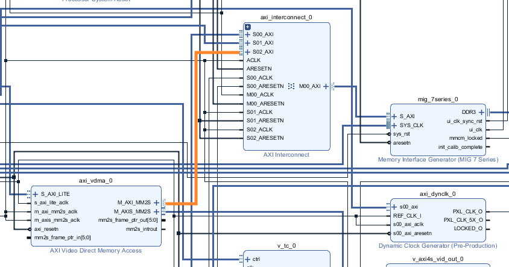
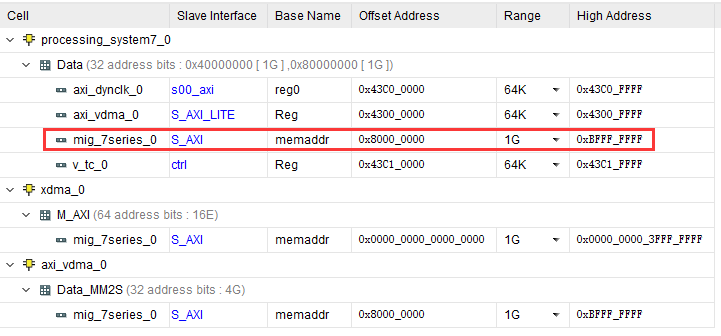
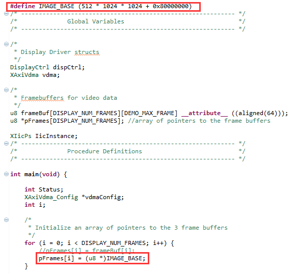
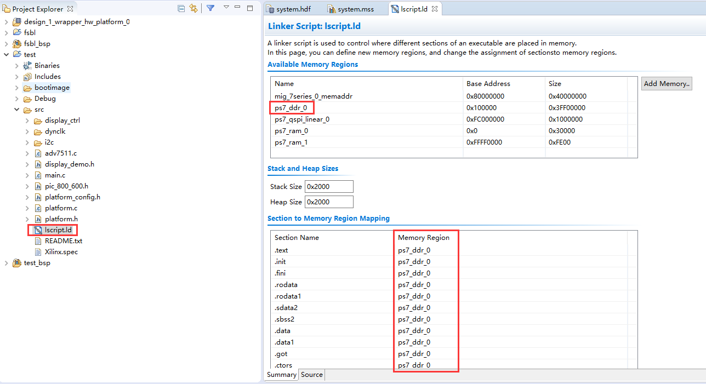
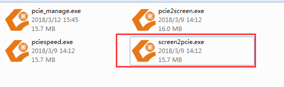
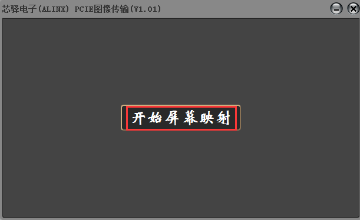

PCIe传输视频到HDMI显示
========================

**实验VIvado工程为“pcie_hdmi_out”。**

以前的实验我们初步接触了PCIe，但没有一个直观的感受，本实验把VDMA和PCIe传输系统结合起来，通过上位机把图像传输到PS的ddr3，再通过VDMA等显示系统把图像通过HDMI输出端口输出显示，充分体现PCIe高带宽传输的优势。

Vivado工程
----------

本实验的Vivado工程是把PCIe测试工程和VDMA的HDMI显示例程合并，搭建过程不再复述，请参考例程附带的Vivado工程。不过要把vdma的MM2S通过interconnect连接到DDR3控制器。

      
Vitis软件
---------

在进行VDMA到HDMI显示的实验时显示缓存是动态分配的，现在想把这个显示缓存的地址通知PCIe上位机应用程序，为了简单，我们把VDMA显示缓存的地址固定，这样PCIe上位机就可以向ddr一个固定区域写入图像数据。

在VDMA显示的试验基础上我们稍微修改一下，把显示缓存固定为512M。由于地址分配的不同，相应的缓存地址需要做偏移。

      

      
在lscript.ld中需要设置将程序跑在PS端DDR中，并保存

      
下载调试
--------

1) 建立FSBL

2) 合成BOOT.bin

3) 烧写BOOT.bin到QSPI flash

4) 板卡设置为QSPI 启动，连接HDMI输出到HDMI显示器

5) 开发板插入机箱，电脑开机后，HDMI默认会有显示

6) 运行上位机软件screen2pcie.exe

      
7) 点击开始屏幕映射，会把当前电脑屏幕抓取，然后通过PCIe传输到VDMA显示缓存（512M），通过连续不断的抓取，可以形成连续的视频

      