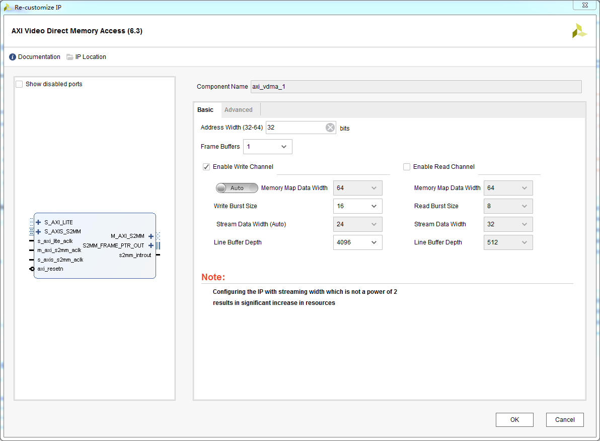
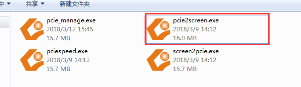
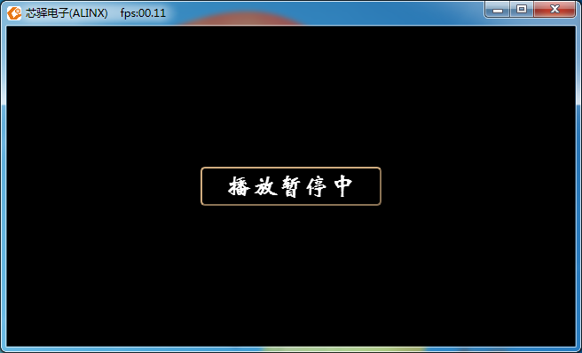

HDMI视频输入到PCIe捕捉显示
============================

**实验VIvado工程为“pcie_hdmi_inout”。**

上面的实验中我们尝试到了PCIe高速传输视频，完成了抓取电脑桌面到HDMI输出的显示，本实验在上面的实验基础上加入HDMI视频输入捕捉的功能。

Vivado硬件功能
--------------

在上面的实验基础上，添加一个VDMA用于HDMI视频的输入。

      
Vitis软件
---------

HDMI接口芯片和VDMA都需要初始化，Vitis软件完成这些初始化工作，和前面的实验一样，用于显示的缓存地址固定为512M，并且把输入VDMA的缓冲区地址也设置为512M，这样HDMI输入视频数据会写入到地址为512M的区域，使用PCIe上位机软件，不同读取PS端ddr的视频内容，然后在电脑上使用OPENGL渲染成视频。

下载调试
--------

1) 建立FSBL

2) 合成BOOT.bin

3) 烧写BOOT.bin到QSPI flash

4) 板卡设置为 QSPI 启动，连接HDMI输出到HDMI显示器，HDMI输入连接到HDMI视频源

5) 开发板插入机箱，电脑开机后，HDMI输出会显示HDMI输入的内容

6) 运行上位机软件pcie2screen.exe

      
7) 打开上位机以后可以看到软件暂停播放

      
8) 点击中间的按钮，开始播放HDMI输入视频源的视频

      